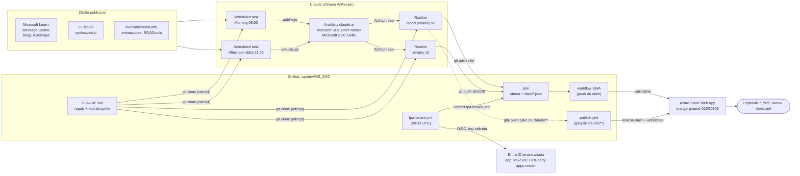
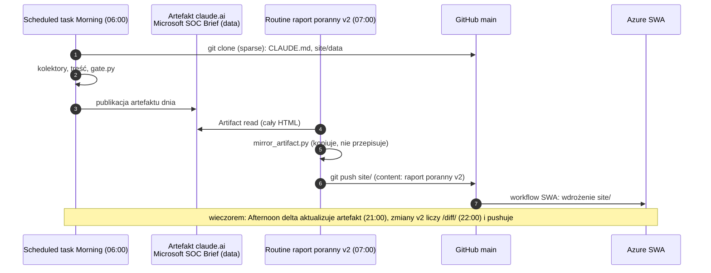
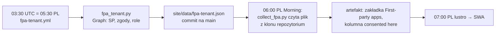
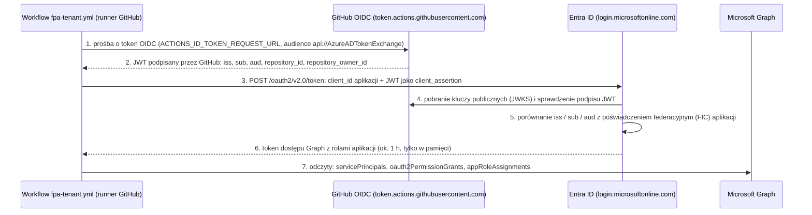

# MS_SOC — Microsoft SOC Brief

| Pole | Wartość |
|---|---|
| Autor | Piotr Wiśniewski — APN Promise S.A. |
| Repozytorium | [github.com/wpiotrw/MS_SOC](https://github.com/wpiotrw/MS_SOC) |
| Strona | [orange-ground-019f30603.7.azurestaticapps.net](https://orange-ground-019f30603.7.azurestaticapps.net/) |
| Źródło prawdy dla kodu i reguł | `CLAUDE.md` (ten plik tylko opisuje całość i to, czego nie ma w `CLAUDE.md`) |

Codzienny portal zmian Microsoftu dla SOC: brief poranny (strona główna), strona zmian `/diff/`, przegląd tygodnia `/week/`, kanał RSS `/feed.xml`. Treść budują zadania Claude (scheduled task i routines) według `CLAUDE.md`; GitHub Actions publikuje katalog `site/` w Azure Static Web Apps.

**Po co ten plik:** żeby po zmianie tenanta, konta Azure albo repozytorium dało się wszystko odtworzyć bez zgadywania. Wszystko, co leży poza repozytorium (aplikacja Entra, zasób Static Web App, sekrety, harmonogramy), jest opisane niżej razem z identyfikatorami.

## Spis treści

- [Skróty](#skróty)
- [0. Architektura w pigułce](#0-architektura-w-pigułce)
- [1. Jak to działa (przepływ dnia)](#1-jak-to-działa-przepływ-dnia)
- [2. Repozytorium](#2-repozytorium)
- [3. Azure Static Web App (hosting)](#3-azure-static-web-app-hosting)
- [4. Zadania Claude (scheduled tasks i routines)](#4-zadania-claude-scheduled-tasks-i-routines)
- [4a. CLAUDE.md i skrypty](#4a-claudemd-i-skrypty)
- [4b. Integracje GitHub](#4b-integracje-github)
- [5. Zakładka First-party apps (od 26 IX 2026, CLAUDE.md §5bl)](#5-zakładka-first-party-apps-od-26-ix-2026-claudemd-5bl)
  - [5.1 Źródła publiczne (czyta collect_fpa.py w przebiegu porannym)](#51-źródła-publiczne-czyta-collect_fpapy-w-przebiegu-porannym)
  - [5.2 Migawka tenanta (GitHub Actions, bez sekretu)](#52-migawka-tenanta-github-actions-bez-sekretu)
    - [Co dokładnie robi migawka i kiedy](#co-dokładnie-robi-migawka-i-kiedy)
    - [Jak działa logowanie bez sekretu (Workload Identity Federation)](#jak-działa-logowanie-bez-sekretu-workload-identity-federation)
    - [Subject tokenu GitHub: skąd repo:wpiotrw@37083541/MS_SOC@1348453327:ref:refs/heads/main](#subject-tokenu-github-skąd-repowpiotrw37083541ms_soc1348453327refrefsheadsmain)
    - [Dodanie poświadczenia federacyjnego: skryptem albo w portalu](#dodanie-poświadczenia-federacyjnego-skryptem-albo-w-portalu)
    - [Dlaczego GitHub Actions i co nam to daje](#dlaczego-github-actions-i-co-nam-to-daje)
  - [5.3 Do zrobienia raz (właściciel)](#53-do-zrobienia-raz-właściciel)
    - [Jak powstają kody logowania (device code) i ile żyją](#jak-powstają-kody-logowania-device-code-i-ile-żyją)
- [6. Pliki danych na stronie](#6-pliki-danych-na-stronie)
- [7. Gdy coś przestanie działać](#7-gdy-coś-przestanie-działać)
- [8. Dokumentacja i źródła](#8-dokumentacja-i-źródła)
- [Historia zmian](#historia-zmian)

## Skróty

| Skrót | Rozwinięcie |
|---|---|
| SOC | Security Operations Center — centrum operacji bezpieczeństwa |
| SWA | Azure Static Web Apps — hosting strony |
| OIDC | OpenID Connect — tu: token GitHub Actions wymieniany na token Entra |
| WIF | Workload Identity Federation — logowanie aplikacji Entra tokenem OIDC, bez sekretu |
| FPA | First-party apps — aplikacje Microsoftu w Entra ID |
| MC | Message Center — komunikaty Microsoft 365 |
| MCP | Model Context Protocol — konektor, przez który zadanie Claude korzysta z zewnętrznej usługi (np. GitHub, Microsoft Learn) |
| UTC | Coordinated Universal Time — czas uniwersalny; Warszawa = UTC+2 latem (CEST), UTC+1 zimą (CET) |
| CEST / CET | Central European Summer Time / Central European Time — czas letni / zimowy w Polsce |
| SP | service principal — obiekt aplikacji w konkretnym tenancie |
| RSS | Really Simple Syndication — kanał wiadomości (`/feed.xml`) |
| CI/CD | Continuous Integration / Continuous Delivery — automatyczne budowanie i wdrażanie |
| CA | Conditional Access — dostęp warunkowy Entra |
| FOCI | Family of Client IDs — rodzina aplikacji Microsoftu współdzielących token odświeżania |
| JWT | JSON Web Token — podpisany token z polami (claims), np. `iss`, `sub`, `aud` |
| JWKS | JSON Web Key Set — publiczne klucze wystawcy, którymi sprawdza się podpis JWT |
| FIC | Federated Identity Credential — poświadczenie federacyjne aplikacji Entra |
| AADSTS | Azure Active Directory Security Token Service — prefiks kodów błędów logowania Entra (np. AADSTS700213) |

## 0. Architektura w pigułce

Całość to **cztery zadania Claude**, **jedno repozytorium GitHub**, **trzy workflow GitHub Actions**, **jedna aplikacja Entra** i **jedna Azure Static Web App**. Zadania Claude zbierają i piszą treść, repozytorium przechowuje reguły, kod i dane, GitHub Actions publikuje, a SWA serwuje stronę.



| Element | Rola | Gdzie żyje | Kto go zmienia |
|---|---|---|---|
| `CLAUDE.md` | reguły, kontrakt strony, **kod wszystkich skryptów** (kolektory, bramka, lustro, diff) | repozytorium | właściciel lub sesja Claude na jego prośbę |
| Scheduled tasks (2) | **budują treść**: czytają źródła i publikują artefakt briefu na claude.ai | chmura Claude, konto właściciela | prompt w ustawieniach zadania; zachowanie przez `CLAUDE.md` |
| Routines (2) | **publikują stronę**: kopiują artefakt do `site/` (lustro) i liczą `/diff/` | chmura Claude (Claude Code), z GitHubem | jw. |
| GitHub Actions (3) | wdrożenie na SWA, most z gałęzi `claude/**`, migawka tenanta | repozytorium, `.github/workflows/` | tylko właściciel (Claude nie edytuje workflow — reguła w `CLAUDE.md`) |
| Aplikacja Entra | tożsamość migawki tenanta, bez sekretu (pkt 5.2) | tenant **wisnia** | właściciel (skrypt `tools/New-FpaReaderApp.ps1` albo portal) |
| Azure Static Web App | hosting gotowego HTML | subskrypcja Azure właściciela | wdrożenia z GitHub Actions |

> [!IMPORTANT]
> **Artefakt jest źródłem, strona jest jego kopią** (`CLAUDE.md` §0a). Brief buduje scheduled task; routine go nie przepisuje ani nie „poprawia”, tylko kopiuje. Dzięki temu artefakt na claude.ai i strona na SWA pokazują to samo.

## 1. Jak to działa (przepływ dnia)

Czasy w strefie Europe/Warsaw (w nawiasie UTC przy czasie letnim).

| Kiedy | Co | Gdzie działa | Wynik |
|---|---|---|---|
| 05:30 (03:30) | `.github/workflows/fpa-tenant.yml` — migawka tenanta dla zakładki First-party apps | GitHub Actions | `site/data/fpa-tenant.json` (commit na `main`) |
| 06:00 (04:00) | scheduled task „raport poranny” — buduje artefakt briefu wg `CLAUDE.md` (kolektory, blok stanu, skrypty 4–17) | Claude (chmura) | artefakt claude.ai z briefem dnia |
| 07:00 (05:00) | routine „raport poranny v2” — lustro artefaktu (`mirror_artifact.py --brief`) | Claude (chmura) | `site/index.html`, `site/data/<data>.json`, `site/feed.xml`, `site/data/history.json`, `site/week/index.html` |
| 21:00 (19:00) | scheduled task popołudniowy — dopisuje sekcję `#pmdelta` do artefaktu i publikuje artefakt „Microsoft SOC Delta” (`make_diff.py`) | Claude (chmura) | artefakt dnia (nowa wersja) i artefakt Delta |
| 22:00 (20:00) | routine „zmiany v2” — buduje `/diff/` (`make_diff.py` z `CLAUDE.md`) | Claude (chmura) | `site/diff/index.html`, plik stanu końcowego dnia |
| każdy push na `main` w `site/**` | `.github/workflows/azure-static-web-apps-orange-ground-019f30603.yml` | GitHub Actions | wdrożenie na SWA |
| push na gałąź `claude/**` w `site/**` | `.github/workflows/publish.yml` — przenosi `site/` z gałęzi rutyny na `main` | GitHub Actions | commit na `main` → wdrożenie |

Ten sam dzień na osi czasu (czas warszawski, lato; szerokość paska = typowy czas trwania z przebiegów 25 IX 2026):

```mermaid
gantt
    dateFormat HH:mm
    axisFormat %H:%M
    title Dzień MS_SOC (Europe/Warsaw, czas letni)
    section GitHub Actions
    fpa-tenant.yml (migawka tenanta)          :a1, 05:30, 5m
    section Scheduled tasks
    Morning - brief i artefakt                  :a2, 06:00, 46m
    Afternoon delta - pmdelta i artefakt Delta  :a4, 21:00, 37m
    section Routines
    raport poranny v2 - lustro do site          :a3, 07:00, 33m
    zmiany v2 - strona diff                     :a5, 22:00, 8m
    section Wdrożenie SWA
    po pushu routine porannej                   :a6, after a3, 3m
    po pushu routine wieczornej                 :a7, after a5, 3m
```



> [!WARNING]
> **Zmiana czasu 25 X 2026.** Scheduled tasks mają harmonogram w strefie `Europe/Warsaw` (`CRON_TZ=Europe/Warsaw 0 6 * * *`, `… 0 21 * * *`), a obie routines w **UTC** (`0 5 * * *`, `0 20 * * *`). Latem to 07:00 i 22:00 w Warszawie, ale **od 25 X 2026 (czas zimowy) routines ruszą o 06:00 i 21:00** — w tej samej minucie co scheduled tasks, zanim artefakt dnia powstanie (poranny brief trwa ~45 min). Lustro nie znajdzie dzisiejszego artefaktu. Rozwiązanie: przed 25 X ustawić w routines `CRON_TZ=Europe/Warsaw 0 7 * * *` i `CRON_TZ=Europe/Warsaw 0 22 * * *` (sam harmonogram, bez zmiany promptu). Workflow `fpa-tenant.yml` (03:30 UTC) zimą ruszy o 04:30 — nadal przed briefem, bez zmian.


Zasady, które trzymają całość w ryzach (szczegóły w `CLAUDE.md`):

- Kod dodawany do strony (skrypty 4–17, bloki CSS, kolektory, `gate.py`, `make_diff.py`, `mirror_artifact.py`) **wycina się z `CLAUDE.md`** skryptem `extract_code.py` (§0c) — nigdy nie przepisuje się go ręcznie ani nie kopiuje z wczorajszej strony. Prompty zadań wskazują na `CLAUDE.md`, więc zmiana kodu nie wymaga zmiany promptów.
- `gate.py` (§0b) to bramka publikacji; pozycje klasy B są raportowane, nie blokują.
- Rejestr uzgodnień (§0f) mówi, co jest zbudowane, a co tylko zaspecyfikowane.

## 2. Repozytorium

| Ścieżka | Zawartość |
|---|---|
| `CLAUDE.md` | reguły, kod i kontrakt strony (jedyne źródło kodu) |
| `community_sources.json`, `microsoftblogs_sources.json`, `microsoftlearn_sources.json` | listy źródeł czytanych przez kolektory |
| `site/` | to, co publikuje SWA (strona, `diff/`, `week/`, `data/`, `history/`, `shell/`, `kql/`, `feed.xml`, `staticwebapp.config.json`) |
| `site/data/<RRRR-MM-DD>.json` | stan dnia (blok `soc-brief-state` + `soc-catalog`); `/diff/` i historia liczą z nich zmiany |
| `site/data/fpa-tenant.json` | migawka tenanta dla zakładki First-party apps (pkt 5) |
| `tools/fpa_tenant.py` | skrypt tej migawki (uruchamia go workflow) |
| `.github/workflows/` | wdrożenie SWA, publikacja z gałęzi rutyn, migawka tenanta |

## 3. Azure Static Web App (hosting)

| Pole | Wartość |
|---|---|
| Adres | https://orange-ground-019f30603.7.azurestaticapps.net/ |
| Nazwa zasobu (z nazwy hosta i workflow) | `orange-ground-019f30603` |
| Wdrożenie | GitHub Actions, [`Azure/static-web-apps-deploy@v1`](https://github.com/Azure/static-web-apps-deploy) ([konfiguracja wdrożenia](https://learn.microsoft.com/azure/static-web-apps/build-configuration)), `action: upload`, `app_location: /site`, `skip_app_build: true` (strona jest gotowym HTML, nic się nie buduje) |
| Sekret w GitHub (Settings → Secrets and variables → Actions) | `AZURE_STATIC_WEB_APPS_API_TOKEN_ORANGE_GROUND_019F30603` — [token wdrożeniowy SWA](https://learn.microsoft.com/azure/static-web-apps/deployment-token-management) |
| Konfiguracja strony | `site/staticwebapp.config.json` ([opis pliku](https://learn.microsoft.com/azure/static-web-apps/configuration)): `navigationFallback` → `/index.html` z wyłączeniem `/diff/*`, `/history/*`, `/data/*`, `*.json`; nagłówki `cache-control: public, max-age=300, must-revalidate`, `X-Content-Type-Options: nosniff`, `X-Frame-Options: DENY`, `Referrer-Policy: no-referrer`; typy MIME dla `.json` i `.html` |
| Subskrypcja, grupa zasobów, plan (SKU), region | **do uzupełnienia** — nie są zapisane w repozytorium, a aplikacja Lokka nie ma ról Azure, więc nie dało się ich odczytać 25 IX 2026. Odczyt: Azure Portal → Static Web Apps → `orange-ground-019f30603` → Overview |

**Odtworzenie w nowej subskrypcji / nowym tenancie Azure**

1. Azure Portal → Create → Static Web App; źródło wdrożenia **Other** (nie łączymy z GitHubem z portalu, workflow już jest).
2. Po utworzeniu: Overview → **Manage deployment token** → skopiuj token ([instrukcja Microsoft](https://learn.microsoft.com/azure/static-web-apps/deployment-token-management)).
3. GitHub → repozytorium → Settings → Secrets and variables → Actions → sekret o nazwie z workflow (albo zmień nazwę sekretu w `.github/workflows/azure-static-web-apps-orange-ground-019f30603.yml`).
4. Nowa strona ma inny adres `*.azurestaticapps.net`. Zmień go w: `CLAUDE.md` (wyszukaj `orange-ground-019f30603`), `mirror_artifact.py` w `CLAUDE.md` (`site_url` w `write_feed`, `write_week`), w tym pliku i ewentualnie w nazwie pliku workflow.
5. Uruchom workflow wdrożenia ręcznie (Actions → Azure Static Web Apps CI/CD → Run workflow) i sprawdź `/`, `/diff/`, `/week/`, `/feed.xml`.

## 4. Zadania Claude (scheduled tasks i routines)

Dwa rodzaje zadań, bo mają różne możliwości: **scheduled task** (Claude, tryb Cowork) ma narzędzie do publikacji artefaktów claude.ai i wszystkie konektory konta, ale nie wypycha zmian do repozytorium; **routine** (Claude Code w chmurze) ma podłączony GitHub i może zrobić `git push`, więc to ono publikuje stronę.

| | Morning | Afternoon delta | raport poranny v2 | zmiany v2 |
|---|---|---|---|---|
| Rodzaj | scheduled task | scheduled task | routine | routine |
| Pełna nazwa | Microsoft SOC Brief — Morning (06:00 Warsaw, codziennie) | Microsoft SOC Brief — Afternoon delta (21:00 Warsaw, codziennie) | MS SOC BRIEF - raport poranny v2 | MS SOC BRIEF - zmiany v2 |
| ID | `trig_017actQokUqkqq9vRfReGbnS` | `trig_01TCAKZsZhEDAuydDCEG9Bmu` | `trig_01WgAAz5UkKaKwE49VY6Y6XG` | `trig_01Gv6tSXTD64NChhaQ2Brx8H` |
| Harmonogram | `CRON_TZ=Europe/Warsaw 0 6 * * *` | `CRON_TZ=Europe/Warsaw 0 21 * * *` | `0 5 * * *` (UTC) | `0 20 * * *` (UTC) |
| Model | `claude-opus-5` | `claude-opus-5` | domyślny | domyślny |
| Zatwierdzanie działań | automatyczne (`auto`) | automatyczne (`auto`) | — (routines nie mają tego ustawienia) | — |
| Konektory (MCP) istotne dla zadania | Microsoft Learn, KQL Search, Context7 (+ pozostałe konektory konta) | jw. | GitHub, Microsoft Learn, KQL Search, Context7, visualize | jw. |
| Czyta | źródła (§7), `CLAUDE.md` i `site/data` z repozytorium (klon sparse, tylko odczyt) | poranny artefakt, źródła, `CLAUDE.md` | dzisiejszy artefakt (Artifact read), `CLAUDE.md` | artefakt dnia i poprzedni stan (`soc-brief-state`, `soc-catalog`) |
| Pisze | artefakt `Microsoft SOC Brief <data>` na claude.ai | nowa wersja tego samego artefaktu (sekcja `#pmdelta`) + artefakt „Microsoft SOC Delta” | `site/index.html`, `site/data/<data>.json`, `feed.xml`, `history.json`, `week/` → `git push origin HEAD:main` | `site/diff/index.html`, poprzednia wersja do `site/history/` → push |
| Powiadomienia | push + e-mail | push + e-mail | e-mail | e-mail |
| Ostatni przebieg (25 IX 2026, UTC) | 04:08–04:54 **OK** | 19:06–19:44 **OK** | 06:19–06:53 **OK** | 20:07–20:15 **FAILED** |

> [!NOTE]
> Prompty są długie (40–92 tys. znaków), ale nie zawierają kodu: każdy krok wskazuje sekcję `CLAUDE.md`, a kod skryptów jest z niego wycinany przy każdym przebiegu. Dlatego zmiana zachowania = zmiana `CLAUDE.md`, bez dotykania promptów. Kopie promptów: projekt Claude „SchedTasks & Routines”, katalog `claude/backup/`. Zasada właściciela: prompt zmienia się tylko po zrobieniu kopii zapasowej.

**Kroki zadań (nagłówki z promptów):**

| Zadanie | Kroki |
|---|---|
| Morning | STEP 0 ciągłość → STEP 1 źródła (§7) → STEP 2 treść raportu (§8) → STEP 2b rejestr zmian 14 dni (§5aj, §5al) → STEP 3 budowa artefaktu HTML → STEP 4 walidacja (`gate.py`) i publikacja |
| Afternoon delta | STEP 1 wczytanie porannego briefu → STEP 2 ponowne przejście źródeł → STEP 3 różnice (+3b katalog) → STEP 4 aktualizacja briefu **w miejscu** (ten sam URL) → STEP 5 odpowiedź |
| raport poranny v2 | STEP −1 **lustro artefaktu** (`mirror_artifact.py`, §0a) — gdy się uda, koniec; STEP 0–4 to ścieżka awaryjna budowania strony, gdy artefaktu nie ma |
| zmiany v2 | STEP 1 dwa stany (starszy i nowszy) → STEP 2 `make_diff.py` (§3) → STEP 3 sprawdzenie pliku → STEP 4 historia, commit, dowód → STEP 5 odpowiedź |



## 4a. `CLAUDE.md` i skrypty

`CLAUDE.md` ma ok. 26,5 tys. wierszy i jest jedynym źródłem kodu. Zadanie **wycina** skrypt poleceniem `extract_code.py` (§0c) do `/tmp` i go uruchamia — nie przepisuje go z pamięci i nie kopiuje z wczorajszej strony.

| Sekcja | O czym | Kto używa |
|---|---|---|
| §0 lista kontrolna | pozycje sprawdzane w każdym przebiegu; klasa A zatrzymuje publikację, klasa B tylko raportuje | wszystkie |
| §0a lustro | artefakt jest źródłem, SWA kopią; procedura i tryby awarii | raport poranny v2 |
| §0b bramka | `gate.py` — asercje przed publikacją | Morning, raport poranny v2 |
| §0c kod z tego pliku | `extract_code.py` | wszystkie |
| §0d migawka powłoki | zapis powłoki strony na wypadek braku artefaktu | routines |
| §0e–§0i | odmowa publikacji ≠ diagnoza, rejestr uzgodnień, przebieg którego nie było, rozmiar `site/`, most `claude/**` | wszystkie |
| §1–§2 | layout strony, który panel co zawiera | Morning |
| §3 | strona zmian `/diff/` i `make_diff.py` | zmiany v2, Afternoon delta |
| §4–§5 (5a…5bl) | reguły treści, zakładki (Graph API, Component versions, Community, Learn, Blogs, First-party apps …) | Morning, Afternoon |
| §7 | źródła — obowiązkowe w całości | Morning, Afternoon |
| §8 | treść raportu | Morning |

| Skrypt (wycinany z `CLAUDE.md`) | Co robi |
|---|---|
| `extract_code.py` | wycina z `CLAUDE.md` blok kodu o danej nazwie |
| `gate.py` | bramka publikacji: asercje klasy A/B, rejestr uzgodnień |
| `mirror_artifact.py` | lustro artefaktu do `site/` (+ `--brief`: feed, historia, tydzień; `--diff`) |
| `make_diff.py` | liczy `/diff/` z dwóch stanów `soc-brief-state` / `soc-catalog` |
| `collect_components.py` | wersje 13 komponentów i treść wydań |
| `collect_blogs.py`, `probe_learn.py`, `learn_changes.py`, `collect_nt.py` | Microsoft Blogs, zmiany Microsoft Learn, zakładka społeczności |
| `collect_fpa.py` | zakładka First-party apps: źródła publiczne + `site/data/fpa-tenant.json` |

| Plik w repozytorium (nie w `CLAUDE.md`) | Co robi |
|---|---|
| `tools/fpa_tenant.py` | migawka tenanta (uruchamia GitHub Actions) |
| `tools/New-FpaReaderApp.ps1` | tworzy aplikację Entra i poświadczenie federacyjne (uruchamia właściciel) |
| `community_sources.json`, `microsoftblogs_sources.json`, `microsoftlearn_sources.json` | listy źródeł dla kolektorów |

## 4b. Integracje GitHub

| Integracja | Do czego | Uprawnienia / sekret |
|---|---|---|
| Repozytorium `wpiotrw/MS_SOC` | publiczne, licencja MIT, gałąź domyślna `main`; utworzone 27 VIII 2026 (ID repozytorium `1348453327`, ID właściciela `37083541`) | — |
| Klon anonimowy (`git clone --depth 1 --filter=blob:none --sparse`) | scheduled tasks czytają `CLAUDE.md` i `site/data` | brak — repozytorium publiczne |
| GitHub w routines (konektor MCP `github` + push z sesji) | routine wypycha `site/` na `main` albo na gałąź `claude/**` | integracja GitHub konta Claude właściciela |
| `publish.yml` | push routine na `claude/**` → kopiuje `site/` na `main` i wdraża | `GITHUB_TOKEN` (`contents: write`) + sekret SWA |
| Workflow SWA | push na `main` w `site/**` → wdrożenie | sekret `AZURE_STATIC_WEB_APPS_API_TOKEN_ORANGE_GROUND_019F30603` |
| `fpa-tenant.yml` | migawka tenanta | `GITHUB_TOKEN` (`contents: write`, `id-token: write`), **bez sekretu Entra** |
| Wspólna kolejka | wszystkie trzy workflow mają [`concurrency`](https://docs.github.com/en/actions/writing-workflows/choosing-what-your-workflow-does/control-the-concurrency-of-workflows-and-jobs) `group: swa-deploy` — nigdy nie wdrażają równolegle | — |
| Sesje Claude (Cowork) | zmiany w repozytorium z rozmów: z chmury `git push` dostaje **403**, więc push idzie z klona na komputerze właściciela (`%LOCALAPPDATA%\Temp\mssoc-repo`, Git Credential Manager) | konto GitHub właściciela |

> [!NOTE]
> Commit zrobiony w workflow tokenem `GITHUB_TOKEN` **nie uruchamia** innych workflow ([GitHub Docs](https://docs.github.com/en/actions/writing-workflows/choosing-when-your-workflow-runs/events-that-trigger-workflows): poza `workflow_dispatch` i `repository_dispatch` zdarzenia z `GITHUB_TOKEN` nie tworzą przebiegów). Commit migawki tenanta nie wdraża więc strony sam — plik trafia na SWA przy najbliższym wdrożeniu (push routine porannej). Dla zakładki to wystarcza, bo brief czyta plik z repozytorium, nie ze strony.

## 5. Zakładka First-party apps (od 26 IX 2026, `CLAUDE.md` §5bl)

Aplikacje Microsoftu w Entra ID: które istnieją, jakie uprawnienia do API mogą uzyskać (z poziomem L1–L4 Microsoftu), co się zmieniło dzień do dnia, jakie zgody i role mają w naszym tenancie. Sekcja `#fpa` na `/diff/`, eksport CSV (nazwa, appId, uprawnienia).

### 5.1 Źródła publiczne (czyta `collect_fpa.py` w przebiegu porannym)

| Źródło | Plik | Daje | Licencja |
|---|---|---|---|
| [merill/microsoft-info](https://github.com/merill/microsoft-info) | `_info/MicrosoftApps.json` | appId, nazwa, tenant właściciela (sweep Graph w tenancie demo autora, 2× dziennie) | MIT |
| [dirkjanm/ROADtools](https://github.com/dirkjanm/ROADtools) | `roadtx/roadtools/roadtx/firstpartyscopes.json` | uprawnienia per API, FOCI, public client, redirect URI (aktualizowane ręcznie co 1–3 mies.) | MIT |
| [zh54321/GraphPreConsentExplorer](https://github.com/zh54321/GraphPreConsentExplorer) | `lists/GraphPreConsent.json` | uprawnienia Graph, auth code, device code, FOCI | MIT |
| [microsoftgraph/microsoft-graph-devx-content](https://github.com/microsoftgraph/microsoft-graph-devx-content) | `permissions/new/permissions.json` | poziom L1–L4 i opis uprawnień Graph | MIT |
| [f-bader/entrascopes.com](https://github.com/f-bader/entrascopes.com) | `resources.json`, `bypasses.json` | nazwy API, znane obejścia CA | brak pliku licencji — tylko odczyt, z podaniem autorów |

Microsoft nie publikuje listy swoich aplikacji ani uprawnień, które nadaje im bez zgody (pre-authorization). Te uprawnienia **wykrywa się, logując się każdą aplikacją** — tak powstają dane ROADtools i Graph Pre-Consent Explorer.

### 5.2 Migawka tenanta (GitHub Actions, bez sekretu)

Źródła publiczne mówią, co aplikacje Microsoftu **mogą** uzyskać. Migawka tenanta mówi, co **zostało im nadane u nas**: zgody delegowane (`oauth2PermissionGrants`) i role aplikacyjne (`appRoleAssignments`) aplikacji spoza naszego tenanta. Czyta ją `tools/fpa_tenant.py`, uruchamiany codziennie przez workflow `fpa-tenant.yml`.

| Pole | Wartość |
|---|---|
| Tenant | **wisnia**, `833fd6f2-76f2-4750-b776-b9228da14a4e` (domena domyślna `azureme.ovh`) |
| Aplikacja Entra | **MS-SOC First-party apps reader** |
| Application (client) ID | `87ab5007-2910-44ee-8715-6475dfd76254` |
| Object ID aplikacji | `161afcd6-bb77-4ff0-ad5a-1075b8053549` |
| Object ID service principala | `66acc967-7c6e-451c-abb1-d1e9e6f8f7fb` |
| Uprawnienia (Application, tylko odczyt) | Microsoft Graph → [**Application.Read.All**](https://learn.microsoft.com/graph/permissions-reference#applicationreadall) (service principale i ich role aplikacyjne) + [**DelegatedPermissionGrant.Read.All**](https://learn.microsoft.com/graph/permissions-reference#delegatedpermissiongrantreadall) (tylko zgody delegowane) |
| Dlaczego nie Directory.Read.All | Directory.Read.All czyta cały katalog: użytkowników, grupy, urządzenia. Dokumentacja Microsoftu podaje go jako „least privileged” dla `GET /oauth2PermissionGrants`, ale Graph ma węższą rolę **DelegatedPermissionGrant.Read.All** („Read all delegated permission grants”). Jeśli Graph jej nie przyjmie (403), skrypt zapisze migawkę bez zgód delegowanych, z polem `grantsNote`, i nie przerwie działania — wtedy decydujemy, czy dodać Directory.Read.All |
| [Zgoda administratora](https://learn.microsoft.com/entra/identity/enterprise-apps/grant-admin-consent) | **nadana** 25 IX 2026 przez skrypt (obie role przypisane do service principala); potwierdzona pierwszym przebiegiem (`grantsNote` puste); sprawdzenie — pkt 5.3, krok 1 |
| Poświadczenie federacyjne (działające) | nazwa `github-ms-soc-main-immutable`, issuer `https://token.actions.githubusercontent.com`, subject `repo:wpiotrw@37083541/MS_SOC@1348453327:ref:refs/heads/main`, audience `api://AzureADTokenExchange` — dodane 25 IX 2026 (skrypt z `-Subject`), bo GitHub wystawia dla tego repozytorium subject niezmienny (opis niżej) |
| Poświadczenie federacyjne (stare, do usunięcia) | nazwa `github-ms-soc-main`, subject `repo:wpiotrw/MS_SOC:ref:refs/heads/main` — format nazwowy; GitHub go dla tego repozytorium nie wystawia, więc logowanie nim kończyło się AADSTS700213. Usuń po pierwszym zielonym przebiegu (Microsoft zaleca nie zostawiać poświadczenia opartego na nazwach) |
| Sekrety | **brak** |
| Workflow | `.github/workflows/fpa-tenant.yml` (codziennie 03:30 UTC i ręcznie); przeniesiony z `tools/` przez właściciela 25 IX 2026 (commit `e2d3f64`) |
| Wynik | `site/data/fpa-tenant.json` |
| Utworzono | 25 IX 2026 skryptem `tools/New-FpaReaderApp.ps1` (logowanie kodem urządzenia kontem `admin@pwisniewskisbhu.onmicrosoft.com`). Pierwszą migawkę zrobi workflow po przeniesieniu (pkt 5.3, krok 2) |
| Poprzednia wersja | Tego samego dnia aplikacja powstała omyłkowo w demo tenancie Contoso (`ea0d500a-…`, appId `373c2197-…`), bo do niego było podłączone narzędzie Lokka. Migawka z Contoso została usunięta ze strony; aplikację w Contoso można usunąć (pkt 5.3, „Usunięcie”) |

#### Co dokładnie robi migawka i kiedy

Workflow działa **automatycznie codziennie o 03:30 UTC** (05:30 latem, 04:30 zimą czasu warszawskiego) i można go uruchomić ręcznie (Actions → „First-party apps tenant snapshot” → Run workflow). Pierwszy udany przebieg: 25 IX 2026, commit `c75f0ce`.

| Krok | Wywołanie (tylko odczyt) | Wynik |
|---|---|---|
| 1. Logowanie | token OIDC GitHuba → token Graph aplikacji (opis niżej) | token na ~1 h, w pamięci |
| 2. Wszystkie service principale tenanta | [`GET /servicePrincipals`](https://learn.microsoft.com/graph/api/serviceprincipal-list)`?$select=id,appId,displayName,appOwnerOrganizationId` | `spTotal`; `spMicrosoft` = te, których właścicielem jest jeden z tenantów Microsoftu (np. `f8cdef31-…`, `72f988bf-…`; [jak Microsoft to weryfikuje](https://learn.microsoft.com/troubleshoot/entra/entra-id/governance/verify-first-party-apps-sign-in)) |
| 3. Zgody delegowane | [`GET /oauth2PermissionGrants`](https://learn.microsoft.com/graph/api/oauth2permissiongrant-list) | per klient: API → zakresy (np. `Microsoft Graph: openid profile`); przy 403 pole `grantsNote` zamiast przerwania |
| 4. Role aplikacyjne | dla każdego SP spoza naszego tenanta: [`GET /servicePrincipals/{id}/appRoleAssignments`](https://learn.microsoft.com/graph/api/serviceprincipal-list-approleassignments) + nazwy ról zasobu | per klient: `API: rola` |
| 5. Zapis | `site/data/fpa-tenant.json` | pola `read`, `tenant`, `spTotal`, `spMicrosoft`, `grantsNote`, `clients[]` |
| 6. Commit | tylko gdy plik się zmienił: `data: first-party apps tenant snapshot <data>` | historia zmian zgód w gicie |

„Klient” to service principal **nienależący do naszego tenanta**, który ma u nas zgodę delegowaną albo rolę aplikacyjną — czyli aplikacja z zewnątrz (Microsoftu albo firmy trzeciej), której ktoś coś nadał.

**Wynik pierwszego przebiegu (25 IX 2026):**

| Miara | Wartość |
|---|---|
| Service principale w tenancie | 475 |
| … należące do tenantów Microsoftu | 410 |
| Klienci z zewnątrz ze zgodą lub rolą | 17 (5 Microsoftu, 12 innych) |
| … ze zgodą delegowaną | 16 |
| … z rolą aplikacyjną | 2 |
| `grantsNote` | puste — **DelegatedPermissionGrant.Read.All wystarcza**, Directory.Read.All nie jest potrzebne |



> [!TIP]
> Nic nie trzeba robić ręcznie. Harmonogram GitHub Actions działa bez komputera i bez sesji Claude. GitHub [wyłącza harmonogramy](https://docs.github.com/actions/managing-workflow-runs/disabling-and-enabling-a-workflow) w repozytorium publicznym po 60 dniach bez aktywności — tu commity są codziennie, więc to nie grozi; gdyby się zdarzyło, workflow włącza się przyciskiem „Enable workflow” w zakładce Actions.

#### Jak działa logowanie bez sekretu (Workload Identity Federation)

W całym łańcuchu nie ma hasła, sekretu ani certyfikatu. Mechanizm nazywa się [Workload Identity Federation](https://learn.microsoft.com/entra/workload-id/workload-identity-federation); jego elementem jest [poświadczenie federacyjne (FIC)](https://learn.microsoft.com/graph/api/resources/federatedidentitycredentials-overview), a wymianę tokenu opisuje [client credentials z poświadczeniem federacyjnym](https://learn.microsoft.com/entra/identity-platform/v2-oauth2-client-creds-grant-flow#third-case-access-token-request-with-a-federated-credential). Po stronie GitHuba: [OpenID Connect reference](https://docs.github.com/en/actions/reference/security/oidc). Zamiast „znam hasło aplikacji” działa zasada „Entra ufa podpisanemu oświadczeniu GitHuba, że ten przebieg pochodzi z tego repozytorium i tej gałęzi”. Aplikacja Entra (App registration) nie przechowuje więc sekretu, tylko **regułę zaufania** (FIC).

**Kto co wie — wszystkie dane potrzebne do logowania:**

| Dana | Skąd ją ma przebieg | Czy jest tajna |
|---|---|---|
| ID tenanta `833fd6f2-…` i ID aplikacji `87ab5007-…` | wpisane jawnie w `env:` pliku `.github/workflows/fpa-tenant.yml` (`AZURE_TENANT_ID`, `AZURE_CLIENT_ID`) | nie — to identyfikatory, nie hasła; sam identyfikator nie pozwala się zalogować |
| Adres, pod którym runner prosi GitHub o token OIDC (`ACTIONS_ID_TOKEN_REQUEST_URL`) i jednorazowy token do tej prośby (`ACTIONS_ID_TOKEN_REQUEST_TOKEN`) | GitHub ustawia je w środowisku runnera **tylko** wtedy, gdy workflow ma `permissions: id-token: write` | token prośby jest ważny tylko w tym przebiegu; GitHub maskuje go w logach |
| Token OIDC (JWT) | `fpa_tenant.py` pobiera go z adresu powyżej, z `audience=api://AzureADTokenExchange` | krótkotrwały, związany z jednym przebiegiem |
| Reguła zaufania (FIC): issuer + subject + audience | zapisana w aplikacji Entra (Certificates & secrets → Federated credentials) | nie — to reguła, nie sekret |
| Klucze publiczne GitHuba do sprawdzenia podpisu | Entra pobiera je sama z `https://token.actions.githubusercontent.com/.well-known/openid-configuration` (JWKS) | publiczne |

**Przebieg krok po kroku:**



1. Workflow ma `permissions: id-token: write`, więc GitHub udostępnia w środowisku `ACTIONS_ID_TOKEN_REQUEST_URL` i `ACTIONS_ID_TOKEN_REQUEST_TOKEN`.
2. `tools/fpa_tenant.py` (funkcja `token()`) prosi o token OIDC. GitHub zwraca JWT podpisany swoim kluczem, z polami m.in. `iss = https://token.actions.githubusercontent.com`, `sub` = z którego repozytorium i gałęzi jest przebieg (format w następnym punkcie), `aud = api://AzureADTokenExchange`. Skrypt wypisuje w logu `iss`, `sub`, `aud` (linia `OIDC claims …`) — to ułatwia diagnozę; sam token nie jest wypisywany.
3. Skrypt wysyła JWT do `https://login.microsoftonline.com/<tenant>/oauth2/v2.0/token` jako `client_assertion` (`client_assertion_type = urn:ietf:params:oauth:client-assertion-type:jwt-bearer`, `grant_type = client_credentials`, `scope = https://graph.microsoft.com/.default`). JWT występuje tu w miejscu, w którym zwykle byłby sekret aplikacji.
4. Entra sprawdza podpis kluczami publicznymi GitHuba i ważność tokenu.
5. Entra szuka w aplikacji `client_id` poświadczenia federacyjnego z **dokładnie** tym samym issuer, subject i audience. Brak zgodności = błąd `AADSTS700213` ([kody błędów Entra](https://learn.microsoft.com/entra/identity-platform/reference-error-codes)) (tak było 25 IX 2026 — opis niżej).
6. Zgodność = token dostępu Graph z rolami aplikacyjnymi, na które administrator dał zgodę (Application.Read.All, DelegatedPermissionGrant.Read.All). Żyje około godziny, istnieje tylko w pamięci przebiegu, nie jest nigdzie zapisywany.

Nie ma czego ukraść ani odnawiać. Token OIDC z innego repozytorium, innej gałęzi albo forka ma inny `sub` i zostanie odrzucony; token przechwycony z logu nie istnieje, bo nie jest wypisywany.

Poświadczenie tworzy skrypt `tools/New-FpaReaderApp.ps1` wywołaniem Graph `POST /applications/{id}/federatedIdentityCredentials`, albo administrator w portalu (niżej). Skrypt `fpa_tenant.py` go **nie tworzy**, tylko z niego korzysta.

#### Subject tokenu GitHub: skąd `repo:wpiotrw@37083541/MS_SOC@1348453327:ref:refs/heads/main`

Pole `sub` tokenu OIDC mówi, **kto** się loguje. GitHub składa je z części oddzielonych dwukropkami:

| Część | Wartość | Znaczenie |
|---|---|---|
| `repo:` | stały prefiks | token pochodzi z workflow repozytorium |
| `wpiotrw@37083541` | login właściciela `@` **ID właściciela** | `37083541` to numeryczne ID konta `wpiotrw` w GitHub |
| `/MS_SOC@1348453327` | nazwa repozytorium `@` **ID repozytorium** | `1348453327` to numeryczne ID repozytorium `MS_SOC` |
| `:ref:refs/heads/main` | typ i nazwa odwołania | przebieg z gałęzi `main` (dla środowiska byłoby `:environment:<nazwa>`, dla pull requestu `:pull_request`) |

**Dlaczego z ID, a nie jak wcześniej `repo:wpiotrw/MS_SOC:ref:refs/heads/main`:** nazwy konta i repozytorium można zmienić, przenieść albo po usunięciu użyć ponownie. Ktoś, kto później założy repozytorium o tej samej nazwie, dostałby token pasujący do starego poświadczenia („subject recycling”). ID są nadawane raz i nigdy nie są używane ponownie. Dlatego GitHub wprowadził format niezmienny (immutable): **repozytoria utworzone po 15 VII 2026 dostają go domyślnie**, starsze mogą go włączyć w ustawieniach OIDC. `MS_SOC` powstało 27 VIII 2026, więc od początku wystawia subject z ID — a poświadczenie było utworzone w starym formacie. Stąd AADSTS700213 przy pierwszym przebiegu.

**Skąd wziąć ID (sprawdzone 25 IX 2026, oba sposoby dają te same liczby):**

- z logu workflow — linia `OIDC claims (federated credential must match): {"sub": "…"}` wypisywana przez `fpa_tenant.py`; to najpewniejsze źródło, bo to dokładnie ten `sub`, który zobaczy Entra;
- z API GitHub: `GET https://api.github.com/repos/wpiotrw/MS_SOC` → pole `id` (ID repozytorium) i `owner.id` (ID właściciela). W PowerShell:

```powershell
$r = Invoke-RestMethod https://api.github.com/repos/wpiotrw/MS_SOC
"repo:$($r.owner.login)@$($r.owner.id)/$($r.name)@$($r.id):ref:refs/heads/main"
```

Token zawiera też osobne pola `repository_id` i `repository_owner_id` z tymi samymi liczbami. Podgląd i zmiana szablonu subject: REST `GET/PUT /repos/{owner}/{repo}/actions/oidc/customization/sub` ([GitHub OIDC reference](https://docs.github.com/en/actions/reference/security/oidc), [GitHub Changelog: immutable subject claims](https://github.blog/changelog/2026-04-23-immutable-subject-claims-for-github-actions-oidc-tokens/), sprawdzone 25 IX 2026).

#### Dodanie poświadczenia federacyjnego: skryptem albo w portalu

Poświadczenie ma zawsze **trzy** pola i wszystkie trzy muszą zgadzać się z tokenem: **issuer** (kto wystawił token), **subject** (kto się loguje) i **audience** (dla kogo token jest przeznaczony). Dla GitHub Actions issuer i audience są zawsze takie same, zmienia się tylko subject:

| Pole | Wartość dla tego repozytorium | Czy się zmienia |
|---|---|---|
| Issuer | `https://token.actions.githubusercontent.com` | nie — ten sam dla wszystkich repozytoriów GitHub.com |
| Subject | `repo:wpiotrw@37083541/MS_SOC@1348453327:ref:refs/heads/main` | tak — zależy od repozytorium, gałęzi i formatu |
| Audience | `api://AzureADTokenExchange` | nie — zalecana wartość Microsoftu dla Entra |

**Dlaczego skrypt przyjmuje tylko subject, a w portalu wpisuje się trzy pola:** skrypt ma issuer i audience wpisane na stałe w kodzie (`tools/New-FpaReaderApp.ps1`, krok 3: `issuer = 'https://token.actions.githubusercontent.com'`, `audiences = @('api://AzureADTokenExchange')`), więc z zewnątrz potrzebuje tylko tej jednej wartości, która się zmienia. Portal nie zna kontekstu, więc w scenariuszu „Other issuer” trzeba podać wszystkie trzy. To te same trzy pola — różni się tylko to, kto je wpisuje.

**Sposób A — skrypt** (PowerShell 7, logowanie kodem urządzenia jak w opisie niżej; konto Cloud Application Administrator albo wyższe):

```powershell
Set-Location "$env:LOCALAPPDATA\Temp\mssoc-repo"; git pull origin main
pwsh -NoProfile -File .\tools\New-FpaReaderApp.ps1 -TenantId 833fd6f2-76f2-4750-b776-b9228da14a4e `
  -Subject 'repo:wpiotrw@37083541/MS_SOC@1348453327:ref:refs/heads/main'
```

Skrypt jest idempotentny: aplikacji, service principala i zgód nie tworzy drugi raz (wypisze `juz nadane`), a poświadczenie dodaje tylko wtedy, gdy nie ma już takiego z tym subjectem. Z `-Subject` nadaje mu nazwę z końcówką `-immutable` (`github-ms-soc-main-immutable`), bo nazwy poświadczeń w aplikacji muszą być unikalne, a stare `github-ms-soc-main` nadal istnieje. Bez `-Subject` używa starego formatu `repo:<Repo>:ref:refs/heads/<Branch>`.

**Sposób B — portal Entra admin center:**

1. [Microsoft Entra admin center](https://entra.microsoft.com) → **Identity → Applications → App registrations → All applications → MS-SOC First-party apps reader**.
2. **Certificates & secrets → zakładka Federated credentials → + Add credential**.
3. **Federated credential scenario: Other issuer.** Scenariusz „GitHub Actions deploying Azure resources” składa subject sam z pól Organization, Repository i Entity type (według dokumentacji Microsoftu), czyli z nazw — dla subjectu z ID wpisujemy go wprost.
4. **Issuer:** `https://token.actions.githubusercontent.com`
5. **Type: Explicit subject identifier**, **Value:** `repo:wpiotrw@37083541/MS_SOC@1348453327:ref:refs/heads/main` — skopiowane dokładnie, bez spacji; wielkość liter ma znaczenie.
6. **Name:** `github-ms-soc-main-immutable`; **Audience:** `api://AzureADTokenExchange` (wartość domyślna — zostaw).
7. **Add.** Potem uruchom workflow ręcznie (Actions → „First-party apps tenant snapshot” → Run workflow).

Po pierwszym zielonym przebiegu usuń stare poświadczenie `github-ms-soc-main` (ta sama zakładka → ikona kosza przy nazwie). Źródła: [Migrate GitHub Actions federated credentials to immutable subjects](https://learn.microsoft.com/entra/workload-id/workload-identities-github-immutable-subjects), [Configure an app to trust an external identity provider](https://learn.microsoft.com/entra/workload-id/workload-identity-federation-create-trust#configure-a-federated-identity-credential-on-an-app), [Graph: create federatedIdentityCredential](https://learn.microsoft.com/graph/api/federatedidentitycredential-post) (sprawdzone 25 IX 2026).

#### Dlaczego GitHub Actions i co nam to daje

- **Działa bez nikogo i bez komputera.** Harmonogram GitHuba uruchamia workflow codziennie, niezależnie od sesji Claude i od tego, czy Twój komputer jest włączony.
- **Tożsamość bez sekretu.** Tylko GitHub Actions (i inne systemy z tokenami OIDC) mogą logować się do Entra przez poświadczenie federacyjne. Zadania Claude takiego tokenu nie mają, więc musiałyby trzymać sekret aplikacji w prompcie albo w pliku, a to nie wchodzi w grę.
- **Uprawnienia są przypięte do repozytorium i gałęzi.** Poświadczenie przyjmuje tylko tokeny z `wpiotrw/MS_SOC` i gałęzi `main`, więc kopia repozytorium albo inna gałąź nic nie dostanie.
- **Ślad i powtarzalność.** Każde uruchomienie ma log w zakładce Actions, a każda zmiana migawki jest commitem w historii repozytorium.
- **Jedno miejsce publikacji.** GitHub Actions już wdraża stronę na Static Web App (push w `site/**`) i przenosi wyniki rutyn z gałęzi `claude/**` na `main`. Migawka tenanta jest trzecim workflow w tym samym mechanizmie. Jej commit uruchamia wdrożenie, a poranny przebieg Claude czyta plik z klonu repozytorium.
- **Koszt:** w publicznym repozytorium minuty GitHub Actions są bezpłatne; w prywatnym mieszczą się w limicie darmowym (przebieg trwa około minuty).

### 5.3 Do zrobienia raz (właściciel)

**Krok 1 — zgoda administratora (sprawdzenie)**

Zgodę nadał skrypt `tools/New-FpaReaderApp.ps1` (przypisanie obu ról aplikacyjnych). Aby to sprawdzić albo nadać ją ręcznie:

1. Otwórz stronę uprawnień aplikacji w Entra admin center (konto z rolą Privileged Role Administrator albo Global Administrator):
   [API permissions aplikacji MS-SOC First-party apps reader](https://entra.microsoft.com/#view/Microsoft_AAD_RegisteredApps/ApplicationMenuBlade/~/CallAnAPI/appId/87ab5007-2910-44ee-8715-6475dfd76254/isMSAApp~/false)
   Jeśli link nie otworzy właściwej strony: **Entra admin center → Identity → Applications → App registrations → All applications → MS-SOC First-party apps reader → API permissions**.
2. Lista zawiera dokładnie dwie pozycje Microsoft Graph typu **Application**: `Application.Read.All` i `DelegatedPermissionGrant.Read.All`.
3. Kolumna Status pokazuje zielone „Granted for wisnia”. Jeśli nie — kliknij **Grant admin consent for wisnia** → **Yes**.

**Krok 2 — przeniesienie workflow do `.github/workflows` (PowerShell + git + gh)**

> [!NOTE]
> **Wykonane 25 IX 2026** (commit `e2d3f64`). Instrukcja zostaje na wypadek odtwarzania w innym repozytorium.

Narzędzia Claude nie mogą zapisywać w `.github/workflows` (ochrona plików CI), dlatego plik czeka w `tools/fpa-tenant.yml`.

```powershell
# 1. Klon repozytorium (ten sam, przez który Claude wypycha zmiany)
Set-Location "$env:LOCALAPPDATA\Temp\mssoc-repo"   # katalog Temp: jesli go nie ma, sklonuj: git clone https://github.com/wpiotrw/MS_SOC.git
git pull origin main

# 2. Przeniesienie pliku do katalogu workflow
git mv tools/fpa-tenant.yml .github/workflows/fpa-tenant.yml
git commit -m "ci: workflow migawki tenanta dla zakladki First-party apps"

# 3. Push. Zmiana pliku workflow wymaga tokenu z zakresem "workflow".
#    Git na tym komputerze loguje sie przez Git Credential Manager (credential.helper = manager),
#    ktory zwykle ma ten zakres. Jesli push zwroci "refusing to allow ... to create or update workflow",
#    dodaj zakres w gh i ustaw gh jako pomocnika logowania gita, potem powtorz push:
#    gh auth refresh -h github.com -s workflow
#    gh auth setup-git
git push origin main

# 4. Pierwsze uruchomienie i podglad (bez czekania do 05:30).
#    gh nie jest w PATH na komputerze apn-k622-2024 (sprawdzone 25 IX 2026);
#    instalacja: winget install --id GitHub.cli, potem nowe okno PowerShell i: gh auth login
#    Bez gh: github.com/wpiotrw/MS_SOC -> Actions -> "First-party apps tenant snapshot" -> Run workflow (main)
gh workflow run fpa-tenant.yml --repo wpiotrw/MS_SOC --ref main
Start-Sleep -Seconds 10
gh run list --repo wpiotrw/MS_SOC --workflow fpa-tenant.yml --limit 1
gh run watch --repo wpiotrw/MS_SOC $(gh run list --repo wpiotrw/MS_SOC --workflow fpa-tenant.yml --limit 1 --json databaseId --jq ".[0].databaseId")
```

Poprawny przebieg kończy się linią `OK site/data/fpa-tenant.json: …` i commitem `data: first-party apps tenant snapshot …` na `main`. Jeśli pojawi się `AADSTS700213` (brak pasującego poświadczenia federacyjnego), porównaj `sub` z linii `OIDC claims …` w logu z subjectem poświadczenia: inny format (z ID albo bez) albo workflow uruchomiony z innej gałęzi niż `main`. Błąd `403` przy `servicePrincipals` oznacza, że krok 1 nie został wykonany.

**Odtworzenie na innym tenancie — skrypt `tools/New-FpaReaderApp.ps1`**

Skrypt robi wszystko w jednym przebiegu i można go uruchamiać wielokrotnie (nie tworzy duplikatów): aplikacja z dwiema rolami Graph, service principal, poświadczenie federacyjne GitHub, zgoda administratora. Loguje się **raz, kodem urządzenia**, przez publicznego klienta Microsoft Graph Command Line Tools, a potem wywołuje Graph REST tym jednym tokenem. Nie potrzebuje modułów `Microsoft.Graph` ani okna logowania WAM, więc działa też z procesu bez okna. Wymaga PowerShell 7 (`pwsh`). Konto: Cloud Application Administrator (aplikacja) oraz Privileged Role Administrator albo Global Administrator (zgoda).

```powershell
Set-Location "$env:LOCALAPPDATA\Temp\mssoc-repo"; git pull origin main
pwsh -NoProfile -File .\tools\New-FpaReaderApp.ps1 -TenantId "<ID tenanta>"
# Skrypt wypisze: KOD: XXXXXXXXX  STRONA: https://login.microsoft.com/device
# Otworz strone, wpisz kod, zaloguj sie kontem admina docelowego tenanta.
# Na koncu wypisze AZURE_TENANT_ID i AZURE_CLIENT_ID (i zapisze JSON w %TEMP%\ms-soc-fpa-app.json).
```

Wypisane wartości wpisz w `env:` pliku `.github/workflows/fpa-tenant.yml` i uruchom workflow ręcznie. Inne repozytorium albo gałąź: parametry `-Repo "<właściciel>/<repo>"` i `-Branch "<gałąź>"` (subject poświadczenia `repo:<właściciel>/<repo>:ref:refs/heads/<gałąź>`). Repozytorium utworzone po 15 VII 2026 (albo z włączonym formatem niezmiennym) wymaga `-Subject` z ID — wartość weź z linii `OIDC claims` w logu albo z API GitHub (pkt 5.2, „Subject tokenu GitHub”).

#### Jak powstają kody logowania (device code) i ile żyją

Kod logowania to przepływ [**OAuth 2.0 device authorization grant**](https://learn.microsoft.com/entra/identity-platform/v2-oauth2-device-code) Microsoft identity platform ([RFC 8628](https://datatracker.ietf.org/doc/html/rfc8628)). Skrypt robi to bez żadnego modułu, dwoma wywołaniami HTTP:

1. **Wygenerowanie kodu:** `POST https://login.microsoftonline.com/<tenant>/oauth2/v2.0/devicecode` z `client_id = 14d82eec-204b-4c2f-b7e8-296a70dab67e` (publiczny klient Microsoft Graph Command Line Tools) i `scope` = zakresy Graph, o które prosimy. Entra odpowiada polami `user_code` (krótki kod, który wpisujesz), `verification_uri` (strona `https://login.microsoft.com/device`), `device_code` (długi kod, którego używa tylko skrypt), `expires_in` i `interval`.
2. **Czekanie na logowanie:** skrypt co `interval` sekund wysyła `POST …/oauth2/v2.0/token` z `grant_type = urn:ietf:params:oauth:grant-type:device_code` i `device_code`. Dopóki nie zalogujesz się w przeglądarce, Entra zwraca `authorization_pending` (skrypt czeka dalej; przy `slow_down` też). Po zalogowaniu zwraca token dostępu. Każdy inny błąd (np. `authorization_declined`, `expired_token`) przerywa skrypt.

**Czas życia kodu ustala Entra, nie skrypt.** Pole `expires_in` w odpowiedzi to liczba sekund do wygaśnięcia `user_code` i `device_code`; według dokumentacji Microsoftu domyślnie 15 minut ([dokumentacja](https://learn.microsoft.com/entra/identity-platform/v2-oauth2-device-code), sprawdzone 25 IX 2026). Klient nie może go wydłużyć. Skrypt czeka dokładnie tyle, ile podała Entra (`$deadline = teraz + expires_in`), a potem kończy się komunikatem „Kod wygasł bez logowania”. Nowy kod = ponowne uruchomienie skryptu. Token dostępu z logowania żyje około godziny (pole `expires_in` odpowiedzi `/token`) i wystarcza na cały przebieg.

**Co zmieniałem 25 IX 2026 i dlaczego (historia prób):**

| Próba | Co się stało | Zmiana |
|---|---|---|
| [`Connect-MgGraph`](https://learn.microsoft.com/powershell/module/microsoft.graph.authentication/connect-mggraph) (logowanie przez przeglądarkę) | W Windows moduł loguje przez WAM (Web Account Manager). Z procesu uruchomionego bez okna kończy się błędem „A window handle must be configured”. `Set-MgGraphOption -DisableLoginByWAM $true` nie pomógł w tym samym przebiegu. | przejście na kod urządzenia |
| `Connect-MgGraph -UseDeviceCode` | Moduł wypisał kod, ale przestał czekać po **120 sekundach** („Authentication timed out after 120 seconds due to inactivity”) — to limit czasu **klienta** (modułu), a nie kodu, który w Entra żył dalej. | `-ClientTimeout 900`, czyli czekanie po stronie klienta wydłużone do 15 minut, tyle co `expires_in` kodu |
| `-UseDeviceCode -ClientTimeout 900` | Przebieg przerwany z zewnątrz (restart narzędzia uruchamiającego polecenia); przy ponownym uruchomieniu w osobnym procesie (`Start-Process pwsh … -RedirectStandardOutput`) moduł po zalogowaniu **poprosił o drugi kod** przy kolejnym wywołaniu Graph. | rezygnacja z modułu |
| Skrypt `New-FpaReaderApp.ps1` (REST) | Jeden kod, jedno logowanie, jeden token na cały przebieg; czeka do `expires_in` z odpowiedzi Entra. Zadziałało za pierwszym razem. | wersja w repozytorium |

Uruchamianie w tle z zapisem wyjścia do pliku, żeby przerwanie narzędzia nie zabiło logowania:

```powershell
Start-Process pwsh -ArgumentList '-NoProfile','-File','.\tools\New-FpaReaderApp.ps1','-TenantId','<ID tenanta>' `
  -RedirectStandardOutput "$env:TEMP\ms-soc-fpa-app.out" -RedirectStandardError "$env:TEMP\ms-soc-fpa-app.err" -WindowStyle Hidden
Get-Content "$env:TEMP\ms-soc-fpa-app.out" -Wait   # pokaże KOD, potem ZALOGOWANO, APLIKACJA, GOTOWE
```

Uwaga bezpieczeństwa: kod urządzenia daje token temu, kto go wpisze i się zaloguje. Nie przekazuj kodu innym osobom, loguj się tylko na `login.microsoft.com/device` i tylko wtedy, gdy sam uruchomiłeś skrypt. Jeśli w tenancie jest [polityka Conditional Access blokująca przepływ kodu urządzenia](https://learn.microsoft.com/entra/identity/conditional-access/policy-block-authentication-flows), skrypt zakończy się błędem logowania — wtedy uruchom go z wyjątkiem w polityce albo użyj skryptu z konta i urządzenia, które polityka dopuszcza.

**Usunięcie** (gdy zakładka nie jest już potrzebna): usuń aplikację w App registrations (usuwa też service principal i poświadczenie) oraz plik workflow. Niepotrzebna kopia w demo tenancie Contoso: appId `373c2197-64a1-41a4-a8b4-70719dc89a27`, tenant `ea0d500a-496c-42eb-a3c0-d834e723edc2`.

## 6. Pliki danych na stronie

| Plik | Pisze | Uwagi |
|---|---|---|
| `site/data/<data>.json` | lustro poranne; przebieg wieczorny nadpisuje stanem końcowym dnia | od 26 IX 2026 zawiera klucz `fpa` |
| `site/data/history.json` | lustro poranne (`write_history`) | historia wartości wpisów z 14 dni |
| `site/data/fpa-tenant.json` | workflow `fpa-tenant.yml` | migawka tenanta |
| `site/feed.xml` | lustro poranne (`write_feed`) | RSS: terminy ≤ 7 dni, nowe, zmiany Graph i ról |
| `site/week/index.html` | lustro poranne (`write_week`) | przegląd tygodnia, druk do PDF |

## 7. Gdy coś przestanie działać

| Objaw | Gdzie patrzeć |
|---|---|
| Strona nie odświeżyła się rano | GitHub → Actions: ostatni przebieg wdrożenia SWA i `publish.yml`; historia uruchomień rutyny w Claude |
| Zakładka First-party apps mówi „No first-party app data” | przebieg poranny nie uruchomił `collect_fpa.py` (pozycja 114 bramki); źródło nieodczytane widać w panelu źródeł zakładki |
| Kolumna „consented here” pusta | brak `site/data/fpa-tenant.json` albo workflow kończy się błędem 403 — brak zgody administratora (pkt 5.3); pole `grantsNote` w pliku = Graph nie przyjął DelegatedPermissionGrant.Read.All |
| `/diff/` pokazuje „baseline” przy First-party apps | pierwszy dzień z kluczem `fpa` albo poprzedni stan go nie ma — to poprawne |
| Workflow migawki: `HTTP 401` i `AADSTS700213` | `sub` z linii `OIDC claims` w logu nie pasuje do poświadczenia federacyjnego (pkt 5.2, „Subject tokenu GitHub”) |
| Workflow migawki: `HTTP 403` przy Graph | brak zgody administratora (pkt 5.3, krok 1) |
| Routine nie wystartowała albo ma status FAILED | historia uruchomień zadania w Claude (link do sesji w e-mailu z powiadomieniem); częsta przyczyna we wrześniu 2026: wyczerpany tygodniowy limit użycia |
| Po 25 X 2026 strona rano nieświeża | routines w UTC ruszają godzinę wcześniej, razem z briefem — pkt 1, ostrzeżenie o zmianie czasu |

## 8. Dokumentacja i źródła

Wszystkie linki sprawdzone 25–26 IX 2026 (Microsoft Learn przez wyszukiwarkę dokumentacji, repozytoria GitHub przez `git ls-remote`).

**Microsoft Entra ID — tożsamość aplikacji i logowanie**

| Temat | Dokumentacja Microsoft |
|---|---|
| Workload Identity Federation (logowanie bez sekretu) | [Workload identity federation concepts](https://learn.microsoft.com/entra/workload-id/workload-identity-federation) |
| Poświadczenie federacyjne w aplikacji — portal | [Configure an app to trust an external identity provider](https://learn.microsoft.com/entra/workload-id/workload-identity-federation-create-trust#configure-a-federated-identity-credential-on-an-app) |
| Subject niezmienny GitHub (z ID) | [Migrate GitHub Actions federated credentials to immutable subjects](https://learn.microsoft.com/entra/workload-id/workload-identities-github-immutable-subjects) |
| Dodawanie poświadczeń aplikacji | [Add and manage application credentials](https://learn.microsoft.com/entra/identity-platform/how-to-add-credentials) |
| Wymiana tokenu OIDC na token Entra | [Client credentials flow — federated credential](https://learn.microsoft.com/entra/identity-platform/v2-oauth2-client-creds-grant-flow#third-case-access-token-request-with-a-federated-credential) |
| Kod urządzenia (device code) | [OAuth 2.0 device authorization grant](https://learn.microsoft.com/entra/identity-platform/v2-oauth2-device-code) |
| Blokowanie kodu urządzenia w Conditional Access | [Block authentication flows with Conditional Access](https://learn.microsoft.com/entra/identity/conditional-access/policy-block-authentication-flows) |
| Zgoda administratora | [Grant tenant-wide admin consent to an application](https://learn.microsoft.com/entra/identity/enterprise-apps/grant-admin-consent) |
| Role administracyjne (Cloud Application Administrator, Privileged Role Administrator) | [Microsoft Entra built-in roles](https://learn.microsoft.com/entra/identity/role-based-access-control/permissions-reference) |
| Kody błędów logowania (AADSTS…) | [Microsoft Entra authentication and authorization error codes](https://learn.microsoft.com/entra/identity-platform/reference-error-codes) |
| Rozpoznawanie aplikacji Microsoftu (`appOwnerOrganizationId`) | [Verify first-party Microsoft applications in sign-in reports](https://learn.microsoft.com/troubleshoot/entra/entra-id/governance/verify-first-party-apps-sign-in) |

**Microsoft Graph — wywołania migawki i skryptu**

| Temat | Dokumentacja Microsoft |
|---|---|
| Uprawnienia Application.Read.All, DelegatedPermissionGrant.Read.All | [Microsoft Graph permissions reference](https://learn.microsoft.com/graph/permissions-reference) |
| Lista service principali | [List servicePrincipals](https://learn.microsoft.com/graph/api/serviceprincipal-list) |
| Zgody delegowane | [List oauth2PermissionGrants](https://learn.microsoft.com/graph/api/oauth2permissiongrant-list) |
| Role aplikacyjne service principala | [List appRoleAssignments granted to a service principal](https://learn.microsoft.com/graph/api/serviceprincipal-list-approleassignments) |
| Poświadczenie federacyjne przez Graph | [Create federatedIdentityCredential](https://learn.microsoft.com/graph/api/federatedidentitycredential-post), [Federated identity credentials overview](https://learn.microsoft.com/graph/api/resources/federatedidentitycredentials-overview) |
| Moduł PowerShell (historia prób) | [Connect-MgGraph](https://learn.microsoft.com/powershell/module/microsoft.graph.authentication/connect-mggraph) |

**Azure Static Web Apps — hosting**

| Temat | Dokumentacja Microsoft |
|---|---|
| Konfiguracja `staticwebapp.config.json` | [Configure Azure Static Web Apps](https://learn.microsoft.com/azure/static-web-apps/configuration) |
| Wdrożenie z GitHub Actions (`skip_app_build`) | [Build configuration for Azure Static Web Apps](https://learn.microsoft.com/azure/static-web-apps/build-configuration) |
| Token wdrożeniowy | [Reset deployment tokens in Azure Static Web Apps](https://learn.microsoft.com/azure/static-web-apps/deployment-token-management) |
| Pytania i odpowiedzi | [Azure Static Web Apps FAQ](https://learn.microsoft.com/azure/static-web-apps/faq) |

**Microsoft 365**

| Temat | Dokumentacja Microsoft |
|---|---|
| Message Center (źródło zakładki MC) | [Message center in the Microsoft 365 admin center](https://learn.microsoft.com/microsoft-365/admin/manage/message-center) |

**GitHub**

| Temat | Dokumentacja GitHub |
|---|---|
| Token OIDC w GitHub Actions, subject, `repository_id` | [OpenID Connect reference](https://docs.github.com/en/actions/reference/security/oidc) |
| Zmiana formatu subject (15 VII 2026) | [Immutable subject claims for GitHub Actions OIDC tokens](https://github.blog/changelog/2026-04-23-immutable-subject-claims-for-github-actions-oidc-tokens/) |
| Harmonogram, `workflow_dispatch`, `GITHUB_TOKEN` nie uruchamia innych workflow | [Events that trigger workflows](https://docs.github.com/en/actions/writing-workflows/choosing-when-your-workflow-runs/events-that-trigger-workflows) |
| Wyłączanie harmonogramu po 60 dniach bez aktywności | [Disabling and enabling a workflow](https://docs.github.com/actions/managing-workflow-runs/disabling-and-enabling-a-workflow) |
| `concurrency` (kolejka `swa-deploy`) | [Control the concurrency of workflows and jobs](https://docs.github.com/en/actions/writing-workflows/choosing-what-your-workflow-does/control-the-concurrency-of-workflows-and-jobs) |
| Akcja wdrożeniowa SWA | [Azure/static-web-apps-deploy](https://github.com/Azure/static-web-apps-deploy) |
| Logowanie gita na Windows | [Git Credential Manager](https://github.com/git-ecosystem/git-credential-manager) |

**Społeczność — źródła zakładki First-party apps i narzędzia**

| Projekt | Autor | Do czego |
|---|---|---|
| [merill/microsoft-info](https://github.com/merill/microsoft-info) | Merill Fernando | lista aplikacji Microsoftu (appId, nazwa, tenant właściciela) |
| [dirkjanm/ROADtools](https://github.com/dirkjanm/ROADtools) | Dirk-jan Mollema | uprawnienia aplikacji Microsoftu wykryte logowaniem, FOCI |
| [zh54321/GraphPreConsentExplorer](https://github.com/zh54321/GraphPreConsentExplorer) | zh54321 | uprawnienia Graph nadane bez zgody (pre-consent) |
| [microsoftgraph/microsoft-graph-devx-content](https://github.com/microsoftgraph/microsoft-graph-devx-content) | Microsoft Graph | poziomy L1–L4 i opisy uprawnień Graph |
| [f-bader/entrascopes.com](https://github.com/f-bader/entrascopes.com) | Fabian Bader | nazwy API i znane obejścia Conditional Access |
| [merill/lokka](https://github.com/merill/lokka) | Merill Fernando | serwer MCP do Microsoft Graph, używany przy konfiguracji aplikacji |

**Standardy**

| Temat | Dokument |
|---|---|
| Kod urządzenia | [RFC 8628 — OAuth 2.0 Device Authorization Grant](https://datatracker.ietf.org/doc/html/rfc8628) |

## Historia zmian

| Data | Zmiana |
|---|---|
| 2026-09-26 | Hiperłącza do dokumentacji Microsoft (Entra, Graph, Static Web Apps, Microsoft 365), GitHub i projektów społeczności w treści (tabele SWA, uprawnień, migawki, logowania, kodu urządzenia) oraz nowa sekcja 8 „Dokumentacja i źródła” z linkami pogrupowanymi tematycznie. |
| 2026-09-26 | Opis całego narzędzia: spis treści, architektura (diagram), oś dnia (diagram Gantta), ostrzeżenie o zmianie czasu 25 X 2026 (routines w UTC), szczegóły czterech zadań Claude (ID, harmonogramy, model, konektory, wejście/wyjście, ostatnie przebiegi, kroki), mapa `CLAUDE.md` i skryptów, integracje GitHub, co robi migawka tenanta i wynik pierwszego przebiegu (475 SP, 17 klientów, `grantsNote` puste), nowe wiersze diagnostyki. Nowe skróty: MCP, UTC, CEST/CET, SP, RSS, CI/CD. |
| 2026-09-25 | Przyczyna błędu AADSTS700213 w pierwszym przebiegu workflow: GitHub wystawia dla `MS_SOC` (utworzone 27 VIII 2026) subject niezmienny z ID właściciela i repozytorium; dodane poświadczenie `github-ms-soc-main-immutable` (skrypt z nowym parametrem `-Subject`). Nowe opisy: jak działa logowanie bez sekretu (tabela danych, diagram, kroki), składnia subjectu i skąd są ID (log, API GitHub), dodanie poświadczenia skryptem albo w portalu i dlaczego skrypt przyjmuje tylko subject; `fpa_tenant.py` wypisuje w logu `iss`/`sub`/`aud` i treść błędu Entra. Nowe skróty: JWT, JWKS, FIC, AADSTS. |
| 2026-09-25 | Opis generowania kodów logowania (device code): wywołania `/devicecode` i `/token`, kto ustala czas życia kodu (`expires_in`, domyślnie 15 min), zmiana `-ClientTimeout` z 120 s na 900 s w `Connect-MgGraph`, historia prób i uruchamianie w tle. |
| 2026-09-25 | Aplikacja „MS-SOC First-party apps reader” przeniesiona do właściwego tenanta **wisnia** (`833fd6f2-…`, azureme.ovh), appId `87ab5007-…`, zgoda administratora nadana; workflow zaktualizowany; dodany skrypt `tools/New-FpaReaderApp.ps1` (logowanie kodem urządzenia) w miejsce przykładu z `Connect-MgGraph`; migawka z demo tenanta Contoso usunięta. |
| 2026-09-25 | Uprawnienia aplikacji zawężone z Directory.Read.All do Application.Read.All + DelegatedPermissionGrant.Read.All; opis logowania federacyjnego, uzasadnienie GitHub Actions, instrukcja zgody administratora i przeniesienia workflow (PowerShell, git, gh). |
| 2026-09-25 | Pełny opis: przepływ dnia, repozytorium, Azure Static Web App (z pozycjami do uzupełnienia), zadania Claude, zakładka First-party apps ze źródłami, aplikacją Entra „MS-SOC First-party apps reader”, poświadczeniem federacyjnym, instrukcją odtworzenia na innym tenancie, pliki danych, diagnostyka. Poprzednia wersja miała 11 linii. |
