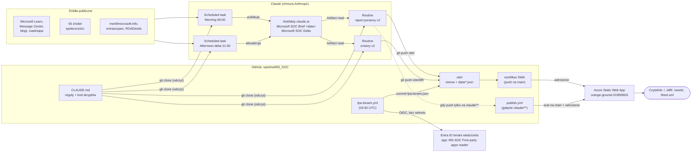
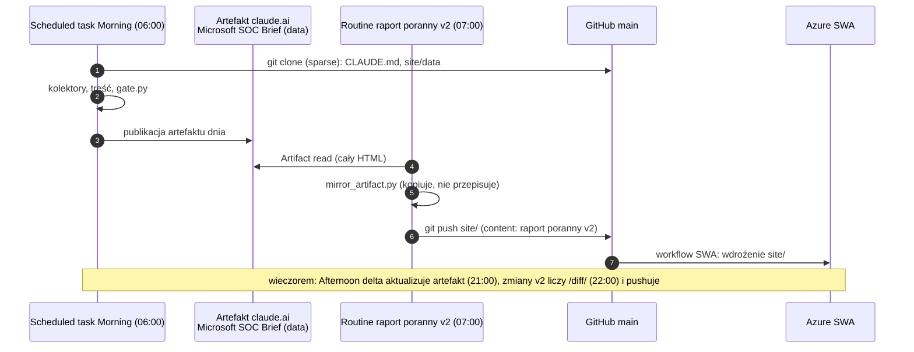
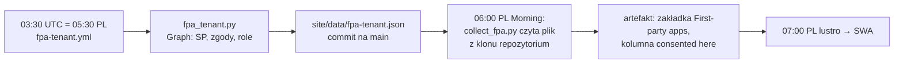
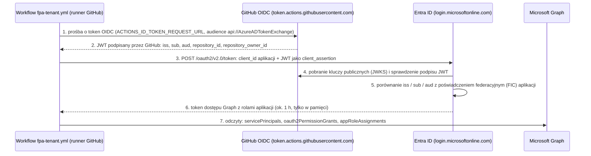

# MS_SOC — Microsoft SOC Brief

| Pole | Wartość |
|---|---|
| Autor | Piotr Wiśniewski — APN Promise S.A. |
| Repozytorium | [github.com/wpiotrw/MS_SOC](https://github.com/wpiotrw/MS_SOC) |
| Strona | [orange-ground-019f30603.7.azurestaticapps.net](https://orange-ground-019f30603.7.azurestaticapps.net/) |
| Źródło prawdy dla kodu i reguł | `CLAUDE.md` (ten plik tylko opisuje całość i to, czego nie ma w `CLAUDE.md`) |

Codzienny portal zmian Microsoftu dla SOC: brief poranny (strona główna), strona zmian `/diff/`, przegląd tygodnia `/week/`, kanał RSS `/feed.xml`. Treść budują zadania Claude (scheduled task i routines) według `CLAUDE.md`; GitHub Actions publikuje katalog `site/` w Azure Static Web Apps.

**Po co ten plik:** żeby po zmianie tenanta, konta Azure albo repozytorium dało się wszystko odtworzyć bez zgadywania. Wszystko, co leży poza repozytorium (aplikacja Entra, zasób Static Web App, sekrety, harmonogramy), jest opisane niżej razem z identyfikatorami.

## Spis treści

- [Skróty](#skróty)
- [0. Architektura w pigułce](#0-architektura-w-pigułce)
- [1. Jak to działa (przepływ dnia)](#1-jak-to-działa-przepływ-dnia)
- [2. Repozytorium](#2-repozytorium)
- [3. Azure Static Web App (hosting)](#3-azure-static-web-app-hosting)
- [4. Zadania Claude (scheduled tasks i routines)](#4-zadania-claude-scheduled-tasks-i-routines)
- [4a. CLAUDE.md i skrypty](#4a-claudemd-i-skrypty)
- [4b. Integracje GitHub](#4b-integracje-github)
- [5. Zakładka First-party apps (od 26 IX 2026, CLAUDE.md §5bl)](#5-zakładka-first-party-apps-od-26-ix-2026-claudemd-5bl)
  - [5.1 Źródła publiczne (czyta collect_fpa.py w przebiegu porannym)](#51-źródła-publiczne-czyta-collect_fpapy-w-przebiegu-porannym)
  - [5.2 Migawka tenanta (GitHub Actions, bez sekretu)](#52-migawka-tenanta-github-actions-bez-sekretu)
    - [Co dokładnie robi migawka i kiedy](#co-dokładnie-robi-migawka-i-kiedy)
    - [Jak działa logowanie bez sekretu (Workload Identity Federation)](#jak-działa-logowanie-bez-sekretu-workload-identity-federation)
    - [Subject tokenu GitHub: skąd repo:wpiotrw@37083541/MS_SOC@1348453327:ref:refs/heads/main](#subject-tokenu-github-skąd-repowpiotrw37083541ms_soc1348453327refrefsheadsmain)
    - [Dodanie poświadczenia federacyjnego: skryptem albo w portalu](#dodanie-poświadczenia-federacyjnego-skryptem-albo-w-portalu)
    - [Dlaczego GitHub Actions i co nam to daje](#dlaczego-github-actions-i-co-nam-to-daje)
  - [5.3 Do zrobienia raz (właściciel)](#53-do-zrobienia-raz-właściciel)
    - [Jak powstają kody logowania (device code) i ile żyją](#jak-powstają-kody-logowania-device-code-i-ile-żyją)
  - [5.4 Message Center — skąd bierzemy wpisy (od 26 IX 2026)](#54-message-center--skąd-bierzemy-wpisy-od-26-ix-2026)
  - [5.5 Własna kopia stron Learn — mirror/ (od 29 IX 2026)](#55-własna-kopia-stron-learn--mirror-od-29-ix-2026)
  - [5.6 Układ zakładek i liczby na stronie (od 29 IX 2026)](#56-układ-zakładek-i-liczby-na-stronie-od-29-ix-2026)
- [6. Pliki danych na stronie](#6-pliki-danych-na-stronie)
- [7. Gdy coś przestanie działać](#7-gdy-coś-przestanie-działać)
- [8. Dokumentacja i źródła](#8-dokumentacja-i-źródła)
- [9. Stan prac i plan](#9-stan-prac-i-plan)
- [10. Dane wrażliwe — co nie trafia do tego pliku ani do repozytorium](#10-dane-wrażliwe--co-nie-trafia-do-tego-pliku-ani-do-repozytorium)
- [Historia zmian](#historia-zmian)

## Skróty

| Skrót | Rozwinięcie |
|---|---|
| SOC | Security Operations Center — centrum operacji bezpieczeństwa |
| SWA | Azure Static Web Apps — hosting strony |
| OIDC | OpenID Connect — tu: token GitHub Actions wymieniany na token Entra |
| WIF | Workload Identity Federation — logowanie aplikacji Entra tokenem OIDC, bez sekretu |
| FPA | First-party apps — aplikacje Microsoftu w Entra ID |
| MC | Message Center — komunikaty Microsoft 365 |
| MCP | Model Context Protocol — konektor, przez który zadanie Claude korzysta z zewnętrznej usługi (np. GitHub, Microsoft Learn) |
| UTC | Coordinated Universal Time — czas uniwersalny; Warszawa = UTC+2 latem (CEST), UTC+1 zimą (CET) |
| CEST / CET | Central European Summer Time / Central European Time — czas letni / zimowy w Polsce |
| SP | service principal — obiekt aplikacji w konkretnym tenancie |
| RSS | Really Simple Syndication — kanał wiadomości (`/feed.xml`) |
| CI/CD | Continuous Integration / Continuous Delivery — automatyczne budowanie i wdrażanie |
| CA | Conditional Access — dostęp warunkowy Entra |
| FOCI | Family of Client IDs — rodzina aplikacji Microsoftu współdzielących token odświeżania |
| JWT | JSON Web Token — podpisany token z polami (claims), np. `iss`, `sub`, `aud` |
| JWKS | JSON Web Key Set — publiczne klucze wystawcy, którymi sprawdza się podpis JWT |
| FIC | Federated Identity Credential — poświadczenie federacyjne aplikacji Entra |
| AADSTS | Azure Active Directory Security Token Service — prefiks kodów błędów logowania Entra (np. AADSTS700213) |
| CC BY 4.0 | Creative Commons Attribution 4.0 — licencja treści Microsoft Learn (wymaga podania autora) |
| DCA | Defender for Cloud Apps |
| ETag | Entity Tag — znacznik wersji strony z nagłówka HTTP; kopia Learn pobiera stronę ponownie tylko, gdy się zmienił |

## 0. Architektura w pigułce

Całość to **cztery zadania Claude**, **jedno repozytorium GitHub**, **trzy workflow GitHub Actions**, **jedna aplikacja Entra** i **jedna Azure Static Web App**. Zadania Claude zbierają i piszą treść, repozytorium przechowuje reguły, kod i dane, GitHub Actions publikuje, a SWA serwuje stronę.


```mermaid
flowchart LR
    subgraph SRC["Źródła publiczne"]
        L["Microsoft Learn,<br/>Message Center,<br/>blogi, roadmapa"]
        C["55 źródeł<br/>społeczności"]
        F["merill/microsoft-info,<br/>entrascopes, ROADtools"]
    end
    subgraph CL["Claude (chmura Anthropic)"]
        ST1["Scheduled task<br/>Morning 06:00"]
        ST2["Scheduled task<br/>Afternoon delta 21:00"]
        R1["Routine<br/>raport poranny v2"]
        R2["Routine<br/>zmiany v2"]
        ART["Artefakty claude.ai<br/>Microsoft SOC Brief &lt;data&gt;<br/>Microsoft SOC Delta"]
    end
    subgraph GH["GitHub: wpiotrw/MS_SOC"]
        MD["CLAUDE.md<br/>reguły + kod skryptów"]
        SITE["site/<br/>strona + data/*.json"]
        W1["workflow SWA<br/>(push na main)"]
        W2["publish.yml<br/>(gałęzie claude/**)"]
        W3["fpa-tenant.yml<br/>(03:30 UTC)"]
    end
    ENTRA["Entra ID tenant właściciela<br/>app: MS-SOC First-party apps reader"]
    SWA["Azure Static Web App<br/>orange-ground-019f30603"]
    U(["Czytelnik: /, /diff/, /week/, /feed.xml"])

    SRC --> ST1 & ST2
    MD -- "git clone (odczyt)" --> ST1 & ST2 & R1 & R2
    ST1 -- publikuje --> ART
    ST2 -- aktualizuje --> ART
    ART -- "Artifact read" --> R1
    ART -- "Artifact read" --> R2
    R1 -- "git push site/" --> SITE
    R2 -- "git push site/diff/" --> SITE
    R1 -. "gdy push tylko na claude/**" .-> W2
    W3 -- "OIDC, bez sekretu" --> ENTRA
    W3 -- "commit fpa-tenant.json" --> SITE
    SITE --> W1
    W1 -- wdrożenie --> SWA
    W2 -- "scal na main + wdrożenie" --> SWA
    SWA --> U
```

| Element | Rola | Gdzie żyje | Kto go zmienia |
|---|---|---|---|
| `CLAUDE.md` | reguły, kontrakt strony, **kod wszystkich skryptów** (kolektory, bramka, lustro, diff) | repozytorium | właściciel lub sesja Claude na jego prośbę |
| Scheduled tasks (2) | **budują treść**: czytają źródła i publikują artefakt briefu na claude.ai | chmura Claude, konto właściciela | prompt w ustawieniach zadania; zachowanie przez `CLAUDE.md` |
| Routines (2) | **publikują stronę**: kopiują artefakt do `site/` (lustro) i liczą `/diff/` | chmura Claude (Claude Code), z GitHubem | jw. |
| GitHub Actions (3) | wdrożenie na SWA, most z gałęzi `claude/**`, migawka tenanta | repozytorium, `.github/workflows/` | tylko właściciel (Claude nie edytuje workflow — reguła w `CLAUDE.md`) |
| Aplikacja Entra | tożsamość migawki tenanta, bez sekretu (pkt 5.2) | tenant właściciela | właściciel (skrypt `tools/New-FpaReaderApp.ps1` albo portal) |
| Azure Static Web App | hosting gotowego HTML | subskrypcja Azure właściciela | wdrożenia z GitHub Actions |

> [!IMPORTANT]
> **Artefakt jest źródłem, strona jest jego kopią** (`CLAUDE.md` §0a). Brief buduje scheduled task; routine go nie przepisuje ani nie „poprawia”, tylko kopiuje. Dzięki temu artefakt na claude.ai i strona na SWA pokazują to samo.

## 1. Jak to działa (przepływ dnia)

Czasy w strefie Europe/Warsaw (w nawiasie UTC przy czasie letnim).

| Kiedy | Co | Gdzie działa | Wynik |
|---|---|---|---|
| co 3 h (`15 */3 * * *` UTC) | `.github/workflows/fpa-tenant.yml` — migawka tenanta (aplikacje Microsoftu, Message Center z Graph) | GitHub Actions | `site/data/fpa-tenant.json`, `site/data/mc-tenant.json` (commit na `main` tylko przy zmianie) |
| 06:00 (04:00) | scheduled task „raport poranny” — buduje artefakt briefu wg `CLAUDE.md` (kolektory, blok stanu, skrypty 4–17) | Claude (chmura) | artefakt claude.ai z briefem dnia |
| 07:00 (05:00) | routine „raport poranny v2” — lustro artefaktu (`mirror_artifact.py --brief`) | Claude (chmura) | `site/index.html`, `site/data/<data>.json`, `site/feed.xml`, `site/data/history.json`, `site/week/index.html` |
| 21:00 (19:00) | scheduled task popołudniowy — dopisuje sekcję `#pmdelta` do artefaktu i publikuje artefakt „Microsoft SOC Delta” (`make_diff.py`) | Claude (chmura) | artefakt dnia (nowa wersja) i artefakt Delta |
| 22:00 (20:00) | routine „zmiany v2” — buduje `/diff/` (`make_diff.py` z `CLAUDE.md`) | Claude (chmura) | `site/diff/index.html`, plik stanu końcowego dnia |
| każdy push na `main` w `site/**` | `.github/workflows/azure-static-web-apps-orange-ground-019f30603.yml` | GitHub Actions | wdrożenie na SWA |
| push na gałąź `claude/**` w `site/**` | `.github/workflows/publish.yml` — przenosi `site/` z gałęzi rutyny na `main` | GitHub Actions | commit na `main` → wdrożenie |

Ten sam dzień na osi czasu (czas warszawski, lato; szerokość paska = typowy czas trwania z przebiegów 25 IX 2026):


```mermaid
gantt
    dateFormat HH:mm
    axisFormat %H:%M
    title Dzień MS_SOC (Europe/Warsaw, czas letni)
    section GitHub Actions
    fpa-tenant.yml (migawka tenanta)          :a1, 05:30, 5m
    section Scheduled tasks
    Morning - brief i artefakt                  :a2, 06:00, 46m
    Afternoon delta - pmdelta i artefakt Delta  :a4, 21:00, 37m
    section Routines
    raport poranny v2 - lustro do site          :a3, 07:00, 33m
    zmiany v2 - strona diff                     :a5, 22:00, 8m
    section Wdrożenie SWA
    po pushu routine porannej                   :a6, after a3, 3m
    po pushu routine wieczornej                 :a7, after a5, 3m
```

> [!WARNING]
> **Zmiana czasu 25 X 2026.** Scheduled tasks mają harmonogram w strefie `Europe/Warsaw` (`CRON_TZ=Europe/Warsaw 0 6 * * *`, `… 0 21 * * *`), a obie routines w **UTC** (`0 5 * * *`, `0 20 * * *`). Latem to 07:00 i 22:00 w Warszawie, ale **od 25 X 2026 (czas zimowy) routines ruszą o 06:00 i 21:00** — w tej samej minucie co scheduled tasks, zanim artefakt dnia powstanie (poranny brief trwa ~45 min). Lustro nie znajdzie dzisiejszego artefaktu. **Zmienić może tylko właściciel, w interfejsie.** Sesja Claude nie może edytować tych routines (utworzone przez API; próba 26 IX 2026 odrzucona: „Agents can only update routines they created”), a interfejs routines nie ma wyboru strefy czasowej. Dlatego godziny przestawia się ręcznie dwa razy w roku:
>
> | Kiedy | [raport poranny v2](https://claude.ai/code/routines/trig_01WgAAz5UkKaKwE49VY6Y6XG) | [zmiany v2](https://claude.ai/code/routines/trig_01Gv6tSXTD64NChhaQ2Brx8H) |
> |---|---|---|
> | 25 X 2026 (czas zimowy) | 05:00 → **06:00 UTC** (= 07:00 w Polsce) | 20:00 → **21:00 UTC** (= 22:00) |
> | 28 III 2027 (czas letni) | 06:00 → **05:00 UTC** (= 07:00) | 21:00 → **20:00 UTC** (= 22:00) |
>
> Przypomnienia (scheduled tasks z powiadomieniem push i e-mail): 24 X 2026 08:00 (`trig_01WBLcAdqi7jH2P1EEtanwtz`) i 27 III 2027 08:00 (`trig_01B73NRpvGfX5fNQZSVYDXXX`). Jeśli interfejs pokazuje godzinę lokalną, po zmianie czasu sprawdź, czy nadal widać 07:00 i 22:00. Workflow `fpa-tenant.yml` (03:30 UTC) zimą ruszy o 04:30 — nadal przed briefem, bez zmian.


Zasady, które trzymają całość w ryzach (szczegóły w `CLAUDE.md`):

- Kod dodawany do strony (skrypty 4–17, bloki CSS, kolektory, `gate.py`, `make_diff.py`, `mirror_artifact.py`) **wycina się z `CLAUDE.md`** skryptem `extract_code.py` (§0c) — nigdy nie przepisuje się go ręcznie ani nie kopiuje z wczorajszej strony. Prompty zadań wskazują na `CLAUDE.md`, więc zmiana kodu nie wymaga zmiany promptów.
- `gate.py` (§0b) to bramka publikacji; pozycje klasy B są raportowane, nie blokują.
- Rejestr uzgodnień (§0f) mówi, co jest zbudowane, a co tylko zaspecyfikowane.

## 2. Repozytorium

| Ścieżka | Zawartość |
|---|---|
| `CLAUDE.md` | reguły, kod i kontrakt strony (jedyne źródło kodu) |
| `community_sources.json`, `microsoftblogs_sources.json`, `microsoftlearn_sources.json` | listy źródeł czytanych przez kolektory |
| `site/` | to, co publikuje SWA (strona, `diff/`, `week/`, `data/`, `history/`, `shell/`, `kql/`, `feed.xml`, `staticwebapp.config.json`) |
| `site/data/<RRRR-MM-DD>.json` | stan dnia (blok `soc-brief-state` + `soc-catalog`); `/diff/` i historia liczą z nich zmiany |
| `site/data/fpa-tenant.json` | migawka tenanta dla zakładki First-party apps (pkt 5) |
| `tools/fpa_tenant.py` | skrypt tej migawki (uruchamia go workflow) |
| `tools/mc_tenant.py` | Message Center tenanta z Graph (krok workflow migawki) |
| `tools/code_refresh.py` | wstawia do `site/index.html` kod z `CLAUDE.md` (skrypty 4–17 i arkusz CSS), danych nie rusza |
| `tools/site_retention.py` | pakuje `site/history/` i starsze stany w `site/data/`, usuwa pliki starsze niż 30 dni (data z nazwy pliku); uruchamia go `code-refresh.yml` |
| `mirror/` | własna kopia stron Microsoft Learn używanych przez portal (pkt 5.5, opis w `mirror/README.md`) |
| `tools/learn-mirror/`, `tools/mirror_scope.py`, `tools/run_learn_mirror.sh` | narzędzie kopii (kopia `merill/learn-mirror`, licencja MIT), liczenie zakresu i przebieg kopii |
| `.claude/rules/ms-soc-spec.md` | zasada dla sesji Claude: `CLAUDE.md` (~2,2 MB) czytać tylko sekcjami, kod wycinać `extract_code.py` |
| `.github/workflows/` | wdrożenie SWA, publikacja z gałęzi rutyn, migawka tenanta (`fpa-tenant.yml`), odświeżenie kodu (`code-refresh.yml`), kopia Learn (`learn-mirror.yml`) |

## 3. Azure Static Web App (hosting)

| Pole | Wartość |
|---|---|
| Adres | https://orange-ground-019f30603.7.azurestaticapps.net/ |
| Nazwa zasobu (z nazwy hosta i workflow) | `orange-ground-019f30603` |
| Wdrożenie | GitHub Actions, [`Azure/static-web-apps-deploy@v1`](https://github.com/Azure/static-web-apps-deploy) ([konfiguracja wdrożenia](https://learn.microsoft.com/azure/static-web-apps/build-configuration)), `action: upload`, `app_location: /site`, `skip_app_build: true` (strona jest gotowym HTML, nic się nie buduje) |
| Sekret w GitHub (Settings → Secrets and variables → Actions) | `AZURE_STATIC_WEB_APPS_API_TOKEN_ORANGE_GROUND_019F30603` — [token wdrożeniowy SWA](https://learn.microsoft.com/azure/static-web-apps/deployment-token-management) |
| Konfiguracja strony | `site/staticwebapp.config.json` ([opis pliku](https://learn.microsoft.com/azure/static-web-apps/configuration)): `navigationFallback` → `/index.html` z wyłączeniem `/diff/*`, `/history/*`, `/data/*`, `*.json`; nagłówki `cache-control: public, max-age=300, must-revalidate`, `X-Content-Type-Options: nosniff`, `X-Frame-Options: DENY`, `Referrer-Policy: no-referrer`; typy MIME dla `.json` i `.html` |
| Plan (SKU) | **Standard** (potwierdzone przez właściciela 30 IX 2026): 500 MB na środowisko, 2 GB łącznie, 15 000 plików ([Quotas in Azure Static Web Apps](https://learn.microsoft.com/azure/static-web-apps/quotas)) |
| Subskrypcja, grupa zasobów, region | **do uzupełnienia** — nie są zapisane w repozytorium, a aplikacja Lokka nie ma ról Azure, więc nie dało się ich odczytać 25 IX 2026. Odczyt: Azure Portal → Static Web Apps → `orange-ground-019f30603` → Overview |

**Odtworzenie w nowej subskrypcji / nowym tenancie Azure**

1. Azure Portal → Create → Static Web App; źródło wdrożenia **Other** (nie łączymy z GitHubem z portalu, workflow już jest).
2. Po utworzeniu: Overview → **Manage deployment token** → skopiuj token ([instrukcja Microsoft](https://learn.microsoft.com/azure/static-web-apps/deployment-token-management)).
3. GitHub → repozytorium → Settings → Secrets and variables → Actions → sekret o nazwie z workflow (albo zmień nazwę sekretu w `.github/workflows/azure-static-web-apps-orange-ground-019f30603.yml`).
4. Nowa strona ma inny adres `*.azurestaticapps.net`. Zmień go w: `CLAUDE.md` (wyszukaj `orange-ground-019f30603`), `mirror_artifact.py` w `CLAUDE.md` (`site_url` w `write_feed`, `write_week`), w tym pliku i ewentualnie w nazwie pliku workflow.
5. Uruchom workflow wdrożenia ręcznie (Actions → Azure Static Web Apps CI/CD → Run workflow) i sprawdź `/`, `/diff/`, `/week/`, `/feed.xml`.

## 4. Zadania Claude (scheduled tasks i routines)

Dwa rodzaje zadań, bo mają różne możliwości: **scheduled task** (Claude, tryb Cowork) ma narzędzie do publikacji artefaktów claude.ai i wszystkie konektory konta, ale nie wypycha zmian do repozytorium; **routine** (Claude Code w chmurze) ma podłączony GitHub i może zrobić `git push`, więc to ono publikuje stronę.

| | Morning | Afternoon delta | raport poranny v2 | zmiany v2 |
|---|---|---|---|---|
| Rodzaj | scheduled task | scheduled task | routine | routine |
| Pełna nazwa | Microsoft SOC Brief — Morning (06:00 Warsaw, codziennie) | Microsoft SOC Brief — Afternoon delta (21:00 Warsaw, codziennie) | MS SOC BRIEF - raport poranny v2 | MS SOC BRIEF - zmiany v2 |
| ID | `trig_017actQokUqkqq9vRfReGbnS` | `trig_01TCAKZsZhEDAuydDCEG9Bmu` | `trig_01WgAAz5UkKaKwE49VY6Y6XG` | `trig_01Gv6tSXTD64NChhaQ2Brx8H` |
| Harmonogram | `CRON_TZ=Europe/Warsaw 0 6 * * *` | `CRON_TZ=Europe/Warsaw 0 21 * * *` | `0 5 * * *` (UTC) | `0 20 * * *` (UTC) |
| Model | `claude-opus-5` | `claude-opus-5` | domyślny | domyślny |
| Zatwierdzanie działań | automatyczne (`auto`) | automatyczne (`auto`) | — (routines nie mają tego ustawienia) | — |
| Konektory (MCP) istotne dla zadania | Microsoft Learn, KQL Search, Context7 (+ pozostałe konektory konta) | jw. | GitHub, Microsoft Learn, KQL Search, Context7, visualize | jw. |
| Czyta | źródła (§7), `CLAUDE.md` i `site/data` z repozytorium (klon sparse, tylko odczyt) | poranny artefakt, źródła, `CLAUDE.md` | dzisiejszy artefakt (Artifact read), `CLAUDE.md` | artefakt dnia i poprzedni stan (`soc-brief-state`, `soc-catalog`) |
| Pisze | artefakt `Microsoft SOC Brief <data>` na claude.ai | nowa wersja tego samego artefaktu (sekcja `#pmdelta`) + artefakt „Microsoft SOC Delta” | `site/index.html`, `site/data/<data>.json`, `feed.xml`, `history.json`, `week/` → `git push origin HEAD:main` | `site/diff/index.html`, poprzednia wersja do `site/history/` → push |
| Powiadomienia | push + e-mail | push + e-mail | e-mail | e-mail |
| Ostatni przebieg (25 IX 2026, UTC) | 04:08–04:54 **OK** | 19:06–19:44 **OK** | 06:19–06:53 **OK** | 20:07–20:15 **FAILED** |

> [!NOTE]
> Prompty są długie (40–92 tys. znaków), ale nie zawierają kodu: każdy krok wskazuje sekcję `CLAUDE.md`, a kod skryptów jest z niego wycinany przy każdym przebiegu. Dlatego zmiana zachowania = zmiana `CLAUDE.md`, bez dotykania promptów. Kopie promptów: projekt Claude „SchedTasks & Routines”, katalog `claude/backup/`. Zasada właściciela: prompt zmienia się tylko po zrobieniu kopii zapasowej.

**Kroki zadań (nagłówki z promptów):**

| Zadanie | Kroki |
|---|---|
| Morning | STEP 0 ciągłość → STEP 1 źródła (§7) → STEP 2 treść raportu (§8) → STEP 2b rejestr zmian 14 dni (§5aj, §5al) → STEP 3 budowa artefaktu HTML → STEP 4 walidacja (`gate.py`) i publikacja |
| Afternoon delta | STEP 1 wczytanie porannego briefu → STEP 2 ponowne przejście źródeł → STEP 3 różnice (+3b katalog) → STEP 4 aktualizacja briefu **w miejscu** (ten sam URL) → STEP 5 odpowiedź |
| raport poranny v2 | STEP −1 **lustro artefaktu** (`mirror_artifact.py`, §0a) — gdy się uda, koniec; STEP 0–4 to ścieżka awaryjna budowania strony, gdy artefaktu nie ma |
| zmiany v2 | STEP 1 dwa stany (starszy i nowszy) → STEP 2 `make_diff.py` (§3) → STEP 3 sprawdzenie pliku → STEP 4 historia, commit, dowód → STEP 5 odpowiedź |


```mermaid
sequenceDiagram
    autonumber
    participant M as Scheduled task Morning (06:00)
    participant A as Artefakt claude.ai<br/>Microsoft SOC Brief (data)
    participant R as Routine raport poranny v2 (07:00)
    participant G as GitHub main
    participant S as Azure SWA
    M->>G: git clone (sparse): CLAUDE.md, site/data
    M->>M: kolektory, treść, gate.py
    M->>A: publikacja artefaktu dnia
    R->>A: Artifact read (cały HTML)
    R->>R: mirror_artifact.py (kopiuje, nie przepisuje)
    R->>G: git push site/ (content: raport poranny v2)
    G->>S: workflow SWA: wdrożenie site/
    Note over M,S: wieczorem: Afternoon delta aktualizuje artefakt (21:00), zmiany v2 liczy /diff/ (22:00) i pushuje
```

## 4a. `CLAUDE.md` i skrypty

`CLAUDE.md` ma ok. 26,5 tys. wierszy i jest jedynym źródłem kodu. Zadanie **wycina** skrypt poleceniem `extract_code.py` (§0c) do `/tmp` i go uruchamia — nie przepisuje go z pamięci i nie kopiuje z wczorajszej strony.

| Sekcja | O czym | Kto używa |
|---|---|---|
| §0 lista kontrolna | pozycje sprawdzane w każdym przebiegu; klasa A zatrzymuje publikację, klasa B tylko raportuje | wszystkie |
| §0a lustro | artefakt jest źródłem, SWA kopią; procedura i tryby awarii | raport poranny v2 |
| §0b bramka | `gate.py` — asercje przed publikacją | Morning, raport poranny v2 |
| §0c kod z tego pliku | `extract_code.py` | wszystkie |
| §0d migawka powłoki | zapis powłoki strony na wypadek braku artefaktu | routines |
| §0e–§0i | odmowa publikacji ≠ diagnoza, rejestr uzgodnień, przebieg którego nie było, rozmiar `site/`, most `claude/**` | wszystkie |
| §1–§2 | layout strony, który panel co zawiera | Morning |
| §3 | strona zmian `/diff/` i `make_diff.py` | zmiany v2, Afternoon delta |
| §4–§5 (5a…5bl) | reguły treści, zakładki (Graph API, Component versions, Community, Learn, Blogs, First-party apps …) | Morning, Afternoon |
| §7 | źródła — obowiązkowe w całości | Morning, Afternoon |
| §8 | treść raportu | Morning |

| Skrypt (wycinany z `CLAUDE.md`) | Co robi |
|---|---|
| `extract_code.py` | wycina z `CLAUDE.md` blok kodu o danej nazwie |
| `gate.py` | bramka publikacji: asercje klasy A/B, rejestr uzgodnień |
| `mirror_artifact.py` | lustro artefaktu do `site/` (+ `--brief`: feed, historia, tydzień; `--diff`) |
| `make_diff.py` | liczy `/diff/` z dwóch stanów `soc-brief-state` / `soc-catalog` |
| `collect_components.py` | wersje 13 komponentów i treść wydań |
| `collect_blogs.py`, `probe_learn.py`, `learn_changes.py`, `collect_nt.py` | Microsoft Blogs, zmiany Microsoft Learn, zakładka społeczności |
| `collect_fpa.py` | zakładka First-party apps: źródła publiczne + `site/data/fpa-tenant.json` |

| Plik w repozytorium (nie w `CLAUDE.md`) | Co robi |
|---|---|
| `tools/fpa_tenant.py` | migawka tenanta (uruchamia GitHub Actions) |
| `tools/New-FpaReaderApp.ps1` | tworzy aplikację Entra i poświadczenie federacyjne (uruchamia właściciel) |
| `community_sources.json`, `microsoftblogs_sources.json`, `microsoftlearn_sources.json` | listy źródeł dla kolektorów |

## 4b. Integracje GitHub

| Integracja | Do czego | Uprawnienia / sekret |
|---|---|---|
| Repozytorium `wpiotrw/MS_SOC` | publiczne, licencja MIT, gałąź domyślna `main`; utworzone 27 VIII 2026 (ID repozytorium `1348453327`, ID właściciela `37083541`) | — |
| Klon anonimowy (`git clone --depth 1 --filter=blob:none --sparse`) | scheduled tasks czytają `CLAUDE.md` i `site/data` | brak — repozytorium publiczne |
| GitHub w routines (konektor MCP `github` + push z sesji) | routine wypycha `site/` na `main` albo na gałąź `claude/**` | integracja GitHub konta Claude właściciela |
| `publish.yml` | push routine na `claude/**` → kopiuje `site/` na `main` i wdraża | `GITHUB_TOKEN` (`contents: write`) + sekret SWA |
| Workflow SWA | push na `main` w `site/**` → wdrożenie | sekret `AZURE_STATIC_WEB_APPS_API_TOKEN_ORANGE_GROUND_019F30603` |
| `fpa-tenant.yml` | migawka tenanta | `GITHUB_TOKEN` (`contents: write`, `id-token: write`), **bez sekretu Entra** |
| `code-refresh.yml` | push zmieniający `CLAUDE.md` (i po migawce tenanta) → `code_refresh.py`, bramka w trybie `--mirror`, commit `site/index.html`, wdrożenie | `GITHUB_TOKEN` (`contents: write`) + sekret SWA |
| `learn-mirror.yml` | 4 razy na dobę (01:37, 07:37, 13:37, 19:37 UTC) odświeża `mirror/learn/`; commituje tylko `mirror/`, więc nie wdraża strony | `GITHUB_TOKEN` (`contents: write`) |
| Wspólna kolejka | workflow wdrażające mają [`concurrency`](https://docs.github.com/en/actions/writing-workflows/choosing-what-your-workflow-does/control-the-concurrency-of-workflows-and-jobs) `group: swa-deploy` — nigdy nie wdrażają równolegle | — |
| Sesje Claude (rozmowy w projekcie „SchedTasks & Routines”) | od 29 IX 2026 sesja w chmurze podłącza repozytorium przez aplikację Claude GitHub (jedno zatwierdzenie na starcie) i wypycha zwykłym `git push`; tak weszły wszystkie zmiany od `a0765ed`. Druga droga: klon na komputerze właściciela (Git Credential Manager, `gh` z zakresem `workflow`). Workflow uruchamiane ręcznie właściciel potwierdza sam | aplikacja Claude GitHub na repozytorium; konto GitHub właściciela |

> [!NOTE]
> Commit zrobiony w workflow tokenem `GITHUB_TOKEN` **nie uruchamia** innych workflow ([GitHub Docs](https://docs.github.com/en/actions/writing-workflows/choosing-when-your-workflow-runs/events-that-trigger-workflows): poza `workflow_dispatch` i `repository_dispatch` zdarzenia z `GITHUB_TOKEN` nie tworzą przebiegów). Commit migawki tenanta nie wdraża więc strony sam — plik trafia na SWA przy najbliższym wdrożeniu (push routine porannej). Dla zakładki to wystarcza, bo brief czyta plik z repozytorium, nie ze strony.

## 5. Zakładka First-party apps (od 26 IX 2026, `CLAUDE.md` §5bl)

Aplikacje Microsoftu w Entra ID: które istnieją, jakie uprawnienia do API mogą uzyskać (z poziomem L1–L4 Microsoftu), co się zmieniło dzień do dnia, jakie zgody i role mają w naszym tenancie. Sekcja `#fpa` na `/diff/`, eksport CSV (nazwa, appId, uprawnienia).

### 5.1 Źródła publiczne (czyta `collect_fpa.py` w przebiegu porannym)

| Źródło | Plik | Daje | Licencja |
|---|---|---|---|
| [merill/microsoft-info](https://github.com/merill/microsoft-info) | `_info/MicrosoftApps.json` | appId, nazwa, tenant właściciela (sweep Graph w tenancie demo autora, 2× dziennie) | MIT |
| [dirkjanm/ROADtools](https://github.com/dirkjanm/ROADtools) | `roadtx/roadtools/roadtx/firstpartyscopes.json` | uprawnienia per API, FOCI, public client, redirect URI (aktualizowane ręcznie co 1–3 mies.) | MIT |
| [zh54321/GraphPreConsentExplorer](https://github.com/zh54321/GraphPreConsentExplorer) | `lists/GraphPreConsent.json` | uprawnienia Graph, auth code, device code, FOCI | MIT |
| [microsoftgraph/microsoft-graph-devx-content](https://github.com/microsoftgraph/microsoft-graph-devx-content) | `permissions/new/permissions.json` | poziom L1–L4 i opis uprawnień Graph | MIT |
| [f-bader/entrascopes.com](https://github.com/f-bader/entrascopes.com) | `resources.json`, `bypasses.json` | nazwy API, znane obejścia CA | brak pliku licencji — tylko odczyt, z podaniem autorów |

Microsoft nie publikuje listy swoich aplikacji ani uprawnień, które nadaje im bez zgody (pre-authorization). Te uprawnienia **wykrywa się, logując się każdą aplikacją** — tak powstają dane ROADtools i Graph Pre-Consent Explorer.

### 5.2 Migawka tenanta (GitHub Actions, bez sekretu)

Źródła publiczne mówią, co aplikacje Microsoftu **mogą** uzyskać. Migawka tenanta mówi, co **zostało im nadane u nas**: zgody delegowane (`oauth2PermissionGrants`) i role aplikacyjne (`appRoleAssignments`) aplikacji spoza naszego tenanta. Czyta ją `tools/fpa_tenant.py`, uruchamiany codziennie przez workflow `fpa-tenant.yml`.

| Pole | Wartość |
|---|---|
| Tenant | tenant właściciela, `833fd6f2-…` (pełne ID: zmienna repozytorium `AZURE_TENANT_ID`) |
| Aplikacja Entra | **MS-SOC First-party apps reader** |
| Application (client) ID | `87ab5007-…` (pełne: zmienna repozytorium `AZURE_CLIENT_ID`) |
| Object ID aplikacji | `161afcd6-…` |
| Object ID service principala | `66acc967-…` |
| Uprawnienia (Application, tylko odczyt) | Microsoft Graph → [**Application.Read.All**](https://learn.microsoft.com/graph/permissions-reference#applicationreadall) (service principale i ich role aplikacyjne) + [**DelegatedPermissionGrant.Read.All**](https://learn.microsoft.com/graph/permissions-reference#delegatedpermissiongrantreadall) (tylko zgody delegowane) |
| Dlaczego nie Directory.Read.All | Directory.Read.All czyta cały katalog: użytkowników, grupy, urządzenia. Dokumentacja Microsoftu podaje go jako „least privileged” dla `GET /oauth2PermissionGrants`, ale Graph ma węższą rolę **DelegatedPermissionGrant.Read.All** („Read all delegated permission grants”). Jeśli Graph jej nie przyjmie (403), skrypt zapisze migawkę bez zgód delegowanych, z polem `grantsNote`, i nie przerwie działania — wtedy decydujemy, czy dodać Directory.Read.All |
| [Zgoda administratora](https://learn.microsoft.com/entra/identity/enterprise-apps/grant-admin-consent) | **nadana** 25 IX 2026 przez skrypt (obie role przypisane do service principala); potwierdzona pierwszym przebiegiem (`grantsNote` puste); sprawdzenie — pkt 5.3, krok 1 |
| Poświadczenie federacyjne (działające) | nazwa `github-ms-soc-main-immutable`, issuer `https://token.actions.githubusercontent.com`, subject `repo:wpiotrw@37083541/MS_SOC@1348453327:ref:refs/heads/main`, audience `api://AzureADTokenExchange` — dodane 25 IX 2026 (skrypt z `-Subject`), bo GitHub wystawia dla tego repozytorium subject niezmienny (opis niżej) |
| Poświadczenie federacyjne (stare, do usunięcia) | nazwa `github-ms-soc-main`, subject `repo:wpiotrw/MS_SOC:ref:refs/heads/main` — format nazwowy; GitHub go dla tego repozytorium nie wystawia, więc logowanie nim kończyło się AADSTS700213. Usuń po pierwszym zielonym przebiegu (Microsoft zaleca nie zostawiać poświadczenia opartego na nazwach) |
| Sekrety | **brak** |
| Workflow | `.github/workflows/fpa-tenant.yml` (codziennie 03:30 UTC i ręcznie); przeniesiony z `tools/` przez właściciela 25 IX 2026 (commit `e2d3f64`) |
| Wynik | `site/data/fpa-tenant.json` |
| Utworzono | 25 IX 2026 skryptem `tools/New-FpaReaderApp.ps1` (logowanie kodem urządzenia kontem administratora tenanta). Pierwsza udana migawka: 25 IX 2026 (commit `c75f0ce`) |
| Poprzednia wersja | Tego samego dnia aplikacja powstała omyłkowo w demo tenancie Contoso (`ea0d500a-…`, appId `373c2197-…`), bo do niego było podłączone narzędzie Lokka. Migawka z Contoso została usunięta ze strony; aplikację w Contoso można usunąć (pkt 5.3, „Usunięcie”) |

#### Co dokładnie robi migawka i kiedy

Workflow działa **automatycznie codziennie o 03:30 UTC** (05:30 latem, 04:30 zimą czasu warszawskiego) i można go uruchomić ręcznie (Actions → „First-party apps tenant snapshot” → Run workflow). Pierwszy udany przebieg: 25 IX 2026, commit `c75f0ce`.

| Krok | Wywołanie (tylko odczyt) | Wynik |
|---|---|---|
| 1. Logowanie | token OIDC GitHuba → token Graph aplikacji (opis niżej) | token na ~1 h, w pamięci |
| 2. Wszystkie service principale tenanta | [`GET /servicePrincipals`](https://learn.microsoft.com/graph/api/serviceprincipal-list)`?$select=id,appId,displayName,appOwnerOrganizationId` | `spTotal`; `spMicrosoft` = te, których właścicielem jest jeden z tenantów Microsoftu (np. `f8cdef31-…`, `72f988bf-…`; [jak Microsoft to weryfikuje](https://learn.microsoft.com/troubleshoot/entra/entra-id/governance/verify-first-party-apps-sign-in)) |
| 3. Zgody delegowane | [`GET /oauth2PermissionGrants`](https://learn.microsoft.com/graph/api/oauth2permissiongrant-list) | per klient: API → zakresy (np. `Microsoft Graph: openid profile`); przy 403 pole `grantsNote` zamiast przerwania |
| 4. Role aplikacyjne | dla każdego SP spoza naszego tenanta: [`GET /servicePrincipals/{id}/appRoleAssignments`](https://learn.microsoft.com/graph/api/serviceprincipal-list-approleassignments) + nazwy ról zasobu | per klient: `API: rola` |
| 5. Zapis | `site/data/fpa-tenant.json` | pola `read`, `tenant`, `spTotal`, `spMicrosoft`, `grantsNote`, `clients[]` |
| 6. Commit | tylko gdy plik się zmienił: `data: first-party apps tenant snapshot <data>` | historia zmian zgód w gicie |

„Klient” to service principal **nienależący do naszego tenanta**, który ma u nas zgodę delegowaną albo rolę aplikacyjną — czyli aplikacja z zewnątrz (Microsoftu albo firmy trzeciej), której ktoś coś nadał.

**Wynik pierwszego przebiegu (25 IX 2026):**

| Miara | Wartość |
|---|---|
| Service principale w tenancie | 475 |
| … należące do tenantów Microsoftu | 410 |
| Klienci z zewnątrz ze zgodą lub rolą | 17 (5 Microsoftu, 12 innych) |
| … ze zgodą delegowaną | 16 |
| … z rolą aplikacyjną | 2 |
| `grantsNote` | puste — **DelegatedPermissionGrant.Read.All wystarcza**, Directory.Read.All nie jest potrzebne |


```mermaid
flowchart LR
    A["03:30 UTC = 05:30 PL<br/>fpa-tenant.yml"] --> B["fpa_tenant.py<br/>Graph: SP, zgody, role"]
    B --> C["site/data/fpa-tenant.json<br/>commit na main"]
    C --> D["06:00 PL Morning:<br/>collect_fpa.py czyta plik<br/>z klonu repozytorium"]
    D --> E["artefakt: zakładka First-party apps,<br/>kolumna consented here"]
    E --> F["07:00 PL lustro → SWA"]
```

> [!TIP]
> Nic nie trzeba robić ręcznie. Harmonogram GitHub Actions działa bez komputera i bez sesji Claude. GitHub [wyłącza harmonogramy](https://docs.github.com/actions/managing-workflow-runs/disabling-and-enabling-a-workflow) w repozytorium publicznym po 60 dniach bez aktywności — tu commity są codziennie, więc to nie grozi; gdyby się zdarzyło, workflow włącza się przyciskiem „Enable workflow” w zakładce Actions.

#### Jak działa logowanie bez sekretu (Workload Identity Federation)

W całym łańcuchu nie ma hasła, sekretu ani certyfikatu. Mechanizm nazywa się [Workload Identity Federation](https://learn.microsoft.com/entra/workload-id/workload-identity-federation); jego elementem jest [poświadczenie federacyjne (FIC)](https://learn.microsoft.com/graph/api/resources/federatedidentitycredentials-overview), a wymianę tokenu opisuje [client credentials z poświadczeniem federacyjnym](https://learn.microsoft.com/entra/identity-platform/v2-oauth2-client-creds-grant-flow#third-case-access-token-request-with-a-federated-credential). Po stronie GitHuba: [OpenID Connect reference](https://docs.github.com/en/actions/reference/security/oidc). Zamiast „znam hasło aplikacji” działa zasada „Entra ufa podpisanemu oświadczeniu GitHuba, że ten przebieg pochodzi z tego repozytorium i tej gałęzi”. Aplikacja Entra (App registration) nie przechowuje więc sekretu, tylko **regułę zaufania** (FIC).

**Kto co wie — wszystkie dane potrzebne do logowania:**

| Dana | Skąd ją ma przebieg | Czy jest tajna |
|---|---|---|
| ID tenanta `833fd6f2-…` i ID aplikacji `87ab5007-…` | zmienne repozytorium `AZURE_TENANT_ID` i `AZURE_CLIENT_ID` (Settings → Secrets and variables → Actions → Variables), czytane w `env:` pliku `.github/workflows/fpa-tenant.yml` jako `${{ vars.… }}` | nie — to identyfikatory, nie hasła; sam identyfikator nie pozwala się zalogować |
| Adres, pod którym runner prosi GitHub o token OIDC (`ACTIONS_ID_TOKEN_REQUEST_URL`) i jednorazowy token do tej prośby (`ACTIONS_ID_TOKEN_REQUEST_TOKEN`) | GitHub ustawia je w środowisku runnera **tylko** wtedy, gdy workflow ma `permissions: id-token: write` | token prośby jest ważny tylko w tym przebiegu; GitHub maskuje go w logach |
| Token OIDC (JWT) | `fpa_tenant.py` pobiera go z adresu powyżej, z `audience=api://AzureADTokenExchange` | krótkotrwały, związany z jednym przebiegiem |
| Reguła zaufania (FIC): issuer + subject + audience | zapisana w aplikacji Entra (Certificates & secrets → Federated credentials) | nie — to reguła, nie sekret |
| Klucze publiczne GitHuba do sprawdzenia podpisu | Entra pobiera je sama z `https://token.actions.githubusercontent.com/.well-known/openid-configuration` (JWKS) | publiczne |

**Przebieg krok po kroku:**


```mermaid
sequenceDiagram
    participant WF as Workflow fpa-tenant.yml (runner GitHub)
    participant GH as GitHub OIDC (token.actions.githubusercontent.com)
    participant EN as Entra ID (login.microsoftonline.com)
    participant GR as Microsoft Graph
    WF->>GH: 1. prośba o token OIDC (ACTIONS_ID_TOKEN_REQUEST_URL, audience api://AzureADTokenExchange)
    GH-->>WF: 2. JWT podpisany przez GitHub: iss, sub, aud, repository_id, repository_owner_id
    WF->>EN: 3. POST /oauth2/v2.0/token: client_id aplikacji + JWT jako client_assertion
    EN->>GH: 4. pobranie kluczy publicznych (JWKS) i sprawdzenie podpisu JWT
    EN->>EN: 5. porównanie iss / sub / aud z poświadczeniem federacyjnym (FIC) aplikacji
    EN-->>WF: 6. token dostępu Graph z rolami aplikacji (ok. 1 h, tylko w pamięci)
    WF->>GR: 7. odczyty: servicePrincipals, oauth2PermissionGrants, appRoleAssignments
```

1. Workflow ma `permissions: id-token: write`, więc GitHub udostępnia w środowisku `ACTIONS_ID_TOKEN_REQUEST_URL` i `ACTIONS_ID_TOKEN_REQUEST_TOKEN`.
2. `tools/fpa_tenant.py` (funkcja `token()`) prosi o token OIDC. GitHub zwraca JWT podpisany swoim kluczem, z polami m.in. `iss = https://token.actions.githubusercontent.com`, `sub` = z którego repozytorium i gałęzi jest przebieg (format w następnym punkcie), `aud = api://AzureADTokenExchange`. Skrypt wypisuje w logu `iss`, `sub`, `aud` (linia `OIDC claims …`) — to ułatwia diagnozę; sam token nie jest wypisywany.
3. Skrypt wysyła JWT do `https://login.microsoftonline.com/<tenant>/oauth2/v2.0/token` jako `client_assertion` (`client_assertion_type = urn:ietf:params:oauth:client-assertion-type:jwt-bearer`, `grant_type = client_credentials`, `scope = https://graph.microsoft.com/.default`). JWT występuje tu w miejscu, w którym zwykle byłby sekret aplikacji.
4. Entra sprawdza podpis kluczami publicznymi GitHuba i ważność tokenu.
5. Entra szuka w aplikacji `client_id` poświadczenia federacyjnego z **dokładnie** tym samym issuer, subject i audience. Brak zgodności = błąd `AADSTS700213` ([kody błędów Entra](https://learn.microsoft.com/entra/identity-platform/reference-error-codes)) (tak było 25 IX 2026 — opis niżej).
6. Zgodność = token dostępu Graph z rolami aplikacyjnymi, na które administrator dał zgodę (Application.Read.All, DelegatedPermissionGrant.Read.All). Żyje około godziny, istnieje tylko w pamięci przebiegu, nie jest nigdzie zapisywany.

Nie ma czego ukraść ani odnawiać. Token OIDC z innego repozytorium, innej gałęzi albo forka ma inny `sub` i zostanie odrzucony; token przechwycony z logu nie istnieje, bo nie jest wypisywany.

Poświadczenie tworzy skrypt `tools/New-FpaReaderApp.ps1` wywołaniem Graph `POST /applications/{id}/federatedIdentityCredentials`, albo administrator w portalu (niżej). Skrypt `fpa_tenant.py` go **nie tworzy**, tylko z niego korzysta.

#### Subject tokenu GitHub: skąd `repo:wpiotrw@37083541/MS_SOC@1348453327:ref:refs/heads/main`

Pole `sub` tokenu OIDC mówi, **kto** się loguje. GitHub składa je z części oddzielonych dwukropkami:

| Część | Wartość | Znaczenie |
|---|---|---|
| `repo:` | stały prefiks | token pochodzi z workflow repozytorium |
| `wpiotrw@37083541` | login właściciela `@` **ID właściciela** | `37083541` to numeryczne ID konta `wpiotrw` w GitHub |
| `/MS_SOC@1348453327` | nazwa repozytorium `@` **ID repozytorium** | `1348453327` to numeryczne ID repozytorium `MS_SOC` |
| `:ref:refs/heads/main` | typ i nazwa odwołania | przebieg z gałęzi `main` (dla środowiska byłoby `:environment:<nazwa>`, dla pull requestu `:pull_request`) |

**Dlaczego z ID, a nie jak wcześniej `repo:wpiotrw/MS_SOC:ref:refs/heads/main`:** nazwy konta i repozytorium można zmienić, przenieść albo po usunięciu użyć ponownie. Ktoś, kto później założy repozytorium o tej samej nazwie, dostałby token pasujący do starego poświadczenia („subject recycling”). ID są nadawane raz i nigdy nie są używane ponownie. Dlatego GitHub wprowadził format niezmienny (immutable): **repozytoria utworzone po 15 VII 2026 dostają go domyślnie**, starsze mogą go włączyć w ustawieniach OIDC. `MS_SOC` powstało 27 VIII 2026, więc od początku wystawia subject z ID — a poświadczenie było utworzone w starym formacie. Stąd AADSTS700213 przy pierwszym przebiegu.

**Skąd wziąć ID (sprawdzone 25 IX 2026, oba sposoby dają te same liczby):**

- z logu workflow — linia `OIDC claims (federated credential must match): {"sub": "…"}` wypisywana przez `fpa_tenant.py`; to najpewniejsze źródło, bo to dokładnie ten `sub`, który zobaczy Entra;
- z API GitHub: `GET https://api.github.com/repos/wpiotrw/MS_SOC` → pole `id` (ID repozytorium) i `owner.id` (ID właściciela). W PowerShell:

```powershell
$r = Invoke-RestMethod https://api.github.com/repos/wpiotrw/MS_SOC
"repo:$($r.owner.login)@$($r.owner.id)/$($r.name)@$($r.id):ref:refs/heads/main"
```

Token zawiera też osobne pola `repository_id` i `repository_owner_id` z tymi samymi liczbami. Podgląd i zmiana szablonu subject: REST `GET/PUT /repos/{owner}/{repo}/actions/oidc/customization/sub` ([GitHub OIDC reference](https://docs.github.com/en/actions/reference/security/oidc), [GitHub Changelog: immutable subject claims](https://github.blog/changelog/2026-04-23-immutable-subject-claims-for-github-actions-oidc-tokens/), sprawdzone 25 IX 2026).

#### Dodanie poświadczenia federacyjnego: skryptem albo w portalu

Poświadczenie ma zawsze **trzy** pola i wszystkie trzy muszą zgadzać się z tokenem: **issuer** (kto wystawił token), **subject** (kto się loguje) i **audience** (dla kogo token jest przeznaczony). Dla GitHub Actions issuer i audience są zawsze takie same, zmienia się tylko subject:

| Pole | Wartość dla tego repozytorium | Czy się zmienia |
|---|---|---|
| Issuer | `https://token.actions.githubusercontent.com` | nie — ten sam dla wszystkich repozytoriów GitHub.com |
| Subject | `repo:wpiotrw@37083541/MS_SOC@1348453327:ref:refs/heads/main` | tak — zależy od repozytorium, gałęzi i formatu |
| Audience | `api://AzureADTokenExchange` | nie — zalecana wartość Microsoftu dla Entra |

**Dlaczego skrypt przyjmuje tylko subject, a w portalu wpisuje się trzy pola:** skrypt ma issuer i audience wpisane na stałe w kodzie (`tools/New-FpaReaderApp.ps1`, krok 3: `issuer = 'https://token.actions.githubusercontent.com'`, `audiences = @('api://AzureADTokenExchange')`), więc z zewnątrz potrzebuje tylko tej jednej wartości, która się zmienia. Portal nie zna kontekstu, więc w scenariuszu „Other issuer” trzeba podać wszystkie trzy. To te same trzy pola — różni się tylko to, kto je wpisuje.

**Sposób A — skrypt** (PowerShell 7, logowanie kodem urządzenia jak w opisie niżej; konto Cloud Application Administrator albo wyższe):

```powershell
Set-Location "$env:LOCALAPPDATA\Temp\mssoc-repo"; git pull origin main
# ID tenanta bierzemy ze zmiennej repozytorium, żeby nie trzymać go w dokumentacji
$tid = gh variable get AZURE_TENANT_ID --repo wpiotrw/MS_SOC
pwsh -NoProfile -File .\tools\New-FpaReaderApp.ps1 -TenantId $tid `
  -Subject 'repo:wpiotrw@37083541/MS_SOC@1348453327:ref:refs/heads/main'
```

Skrypt jest idempotentny: aplikacji, service principala i zgód nie tworzy drugi raz (wypisze `juz nadane`), a poświadczenie dodaje tylko wtedy, gdy nie ma już takiego z tym subjectem. Z `-Subject` nadaje mu nazwę z końcówką `-immutable` (`github-ms-soc-main-immutable`), bo nazwy poświadczeń w aplikacji muszą być unikalne, a stare `github-ms-soc-main` nadal istnieje. Bez `-Subject` używa starego formatu `repo:<Repo>:ref:refs/heads/<Branch>`.

**Sposób B — portal Entra admin center:**

1. [Microsoft Entra admin center](https://entra.microsoft.com) → **Identity → Applications → App registrations → All applications → MS-SOC First-party apps reader**.
2. **Certificates & secrets → zakładka Federated credentials → + Add credential**.
3. **Federated credential scenario: Other issuer.** Scenariusz „GitHub Actions deploying Azure resources” składa subject sam z pól Organization, Repository i Entity type (według dokumentacji Microsoftu), czyli z nazw — dla subjectu z ID wpisujemy go wprost.
4. **Issuer:** `https://token.actions.githubusercontent.com`
5. **Type: Explicit subject identifier**, **Value:** `repo:wpiotrw@37083541/MS_SOC@1348453327:ref:refs/heads/main` — skopiowane dokładnie, bez spacji; wielkość liter ma znaczenie.
6. **Name:** `github-ms-soc-main-immutable`; **Audience:** `api://AzureADTokenExchange` (wartość domyślna — zostaw).
7. **Add.** Potem uruchom workflow ręcznie (Actions → „First-party apps tenant snapshot” → Run workflow).

Po pierwszym zielonym przebiegu usuń stare poświadczenie `github-ms-soc-main` (ta sama zakładka → ikona kosza przy nazwie). Źródła: [Migrate GitHub Actions federated credentials to immutable subjects](https://learn.microsoft.com/entra/workload-id/workload-identities-github-immutable-subjects), [Configure an app to trust an external identity provider](https://learn.microsoft.com/entra/workload-id/workload-identity-federation-create-trust#configure-a-federated-identity-credential-on-an-app), [Graph: create federatedIdentityCredential](https://learn.microsoft.com/graph/api/federatedidentitycredential-post) (sprawdzone 25 IX 2026).

#### Dlaczego GitHub Actions i co nam to daje

- **Działa bez nikogo i bez komputera.** Harmonogram GitHuba uruchamia workflow codziennie, niezależnie od sesji Claude i od tego, czy Twój komputer jest włączony.
- **Tożsamość bez sekretu.** Tylko GitHub Actions (i inne systemy z tokenami OIDC) mogą logować się do Entra przez poświadczenie federacyjne. Zadania Claude takiego tokenu nie mają, więc musiałyby trzymać sekret aplikacji w prompcie albo w pliku, a to nie wchodzi w grę.
- **Uprawnienia są przypięte do repozytorium i gałęzi.** Poświadczenie przyjmuje tylko tokeny z `wpiotrw/MS_SOC` i gałęzi `main`, więc kopia repozytorium albo inna gałąź nic nie dostanie.
- **Ślad i powtarzalność.** Każde uruchomienie ma log w zakładce Actions, a każda zmiana migawki jest commitem w historii repozytorium.
- **Jedno miejsce publikacji.** GitHub Actions już wdraża stronę na Static Web App (push w `site/**`) i przenosi wyniki rutyn z gałęzi `claude/**` na `main`. Migawka tenanta jest trzecim workflow w tym samym mechanizmie. Jej commit uruchamia wdrożenie, a poranny przebieg Claude czyta plik z klonu repozytorium.
- **Koszt:** w publicznym repozytorium minuty GitHub Actions są bezpłatne; w prywatnym mieszczą się w limicie darmowym (przebieg trwa około minuty).

### 5.3 Do zrobienia raz (właściciel)

**Krok 1 — zgoda administratora (sprawdzenie)**

Zgodę nadał skrypt `tools/New-FpaReaderApp.ps1` (przypisanie obu ról aplikacyjnych). Aby to sprawdzić albo nadać ją ręcznie:

1. Otwórz stronę uprawnień aplikacji w Entra admin center (konto z rolą Privileged Role Administrator albo Global Administrator):
   [Microsoft Entra admin center](https://entra.microsoft.com) → **Identity → Applications → App registrations → All applications → MS-SOC First-party apps reader → API permissions**.
2. Lista zawiera dokładnie dwie pozycje Microsoft Graph typu **Application**: `Application.Read.All` i `DelegatedPermissionGrant.Read.All`.
3. Kolumna Status pokazuje zielone „Granted for <nazwa tenanta>”. Jeśli nie — kliknij **Grant admin consent for <nazwa tenanta>** → **Yes**.

**Krok 2 — przeniesienie workflow do `.github/workflows` (PowerShell + git + gh)**

> [!NOTE]
> **Wykonane 25 IX 2026** (commit `e2d3f64`). Instrukcja zostaje na wypadek odtwarzania w innym repozytorium.

Narzędzia Claude nie mogą zapisywać w `.github/workflows` (ochrona plików CI), dlatego plik czeka w `tools/fpa-tenant.yml`.

```powershell
# 1. Klon repozytorium (ten sam, przez który Claude wypycha zmiany)
Set-Location "$env:LOCALAPPDATA\Temp\mssoc-repo"   # katalog Temp: jesli go nie ma, sklonuj: git clone https://github.com/wpiotrw/MS_SOC.git
git pull origin main

# 2. Przeniesienie pliku do katalogu workflow
git mv tools/fpa-tenant.yml .github/workflows/fpa-tenant.yml
git commit -m "ci: workflow migawki tenanta dla zakladki First-party apps"

# 3. Push. Zmiana pliku workflow wymaga tokenu z zakresem "workflow".
#    Git na tym komputerze loguje sie przez Git Credential Manager (credential.helper = manager),
#    ktory zwykle ma ten zakres. Jesli push zwroci "refusing to allow ... to create or update workflow",
#    dodaj zakres w gh i ustaw gh jako pomocnika logowania gita, potem powtorz push:
#    gh auth refresh -h github.com -s workflow
#    gh auth setup-git
git push origin main

# 4. Pierwsze uruchomienie i podglad (bez czekania do 05:30).
#    gh 2.101.0 jest zainstalowany na komputerze właściciela (winget) i zalogowany jako wpiotrw, zakresy repo + workflow (sprawdzone 26 IX 2026);
#    na nowym komputerze: winget install --id GitHub.cli, potem nowe okno PowerShell i: gh auth login
#    Bez gh: github.com/wpiotrw/MS_SOC -> Actions -> "First-party apps tenant snapshot" -> Run workflow (main)
gh workflow run fpa-tenant.yml --repo wpiotrw/MS_SOC --ref main
Start-Sleep -Seconds 10
gh run list --repo wpiotrw/MS_SOC --workflow fpa-tenant.yml --limit 1
gh run watch --repo wpiotrw/MS_SOC $(gh run list --repo wpiotrw/MS_SOC --workflow fpa-tenant.yml --limit 1 --json databaseId --jq ".[0].databaseId")
```

Poprawny przebieg kończy się linią `OK site/data/fpa-tenant.json: …` i commitem `data: first-party apps tenant snapshot …` na `main`. Jeśli pojawi się `AADSTS700213` (brak pasującego poświadczenia federacyjnego), porównaj `sub` z linii `OIDC claims …` w logu z subjectem poświadczenia: inny format (z ID albo bez) albo workflow uruchomiony z innej gałęzi niż `main`. Błąd `403` przy `servicePrincipals` oznacza, że krok 1 nie został wykonany.

**Odtworzenie na innym tenancie — skrypt `tools/New-FpaReaderApp.ps1`**

Skrypt robi wszystko w jednym przebiegu i można go uruchamiać wielokrotnie (nie tworzy duplikatów): aplikacja z dwiema rolami Graph, service principal, poświadczenie federacyjne GitHub, zgoda administratora. Loguje się **raz, kodem urządzenia**, przez publicznego klienta Microsoft Graph Command Line Tools, a potem wywołuje Graph REST tym jednym tokenem. Nie potrzebuje modułów `Microsoft.Graph` ani okna logowania WAM, więc działa też z procesu bez okna. Wymaga PowerShell 7 (`pwsh`). Konto: Cloud Application Administrator (aplikacja) oraz Privileged Role Administrator albo Global Administrator (zgoda).

```powershell
Set-Location "$env:LOCALAPPDATA\Temp\mssoc-repo"; git pull origin main
pwsh -NoProfile -File .\tools\New-FpaReaderApp.ps1 -TenantId "<ID tenanta>"
# Skrypt wypisze: KOD: XXXXXXXXX  STRONA: https://login.microsoft.com/device
# Otworz strone, wpisz kod, zaloguj sie kontem admina docelowego tenanta.
# Na koncu wypisze AZURE_TENANT_ID i AZURE_CLIENT_ID (i zapisze JSON w %TEMP%\ms-soc-fpa-app.json).
```

Wypisane wartości zapisz jako zmienne repozytorium (`gh variable set AZURE_TENANT_ID --body <ID> --repo <właściciel>/<repo>`, tak samo `AZURE_CLIENT_ID`) i uruchom workflow ręcznie. Workflow czyta je jako `${{ vars.AZURE_TENANT_ID }}` i `${{ vars.AZURE_CLIENT_ID }}` — pełnych ID nie ma w żadnym pliku repozytorium. Inne repozytorium albo gałąź: parametry `-Repo "<właściciel>/<repo>"` i `-Branch "<gałąź>"` (subject poświadczenia `repo:<właściciel>/<repo>:ref:refs/heads/<gałąź>`). Repozytorium utworzone po 15 VII 2026 (albo z włączonym formatem niezmiennym) wymaga `-Subject` z ID — wartość weź z linii `OIDC claims` w logu albo z API GitHub (pkt 5.2, „Subject tokenu GitHub”).

#### Jak powstają kody logowania (device code) i ile żyją

Kod logowania to przepływ [**OAuth 2.0 device authorization grant**](https://learn.microsoft.com/entra/identity-platform/v2-oauth2-device-code) Microsoft identity platform ([RFC 8628](https://datatracker.ietf.org/doc/html/rfc8628)). Skrypt robi to bez żadnego modułu, dwoma wywołaniami HTTP:

1. **Wygenerowanie kodu:** `POST https://login.microsoftonline.com/<tenant>/oauth2/v2.0/devicecode` z `client_id = 14d82eec-204b-4c2f-b7e8-296a70dab67e` (publiczny klient Microsoft Graph Command Line Tools) i `scope` = zakresy Graph, o które prosimy. Entra odpowiada polami `user_code` (krótki kod, który wpisujesz), `verification_uri` (strona `https://login.microsoft.com/device`), `device_code` (długi kod, którego używa tylko skrypt), `expires_in` i `interval`.
2. **Czekanie na logowanie:** skrypt co `interval` sekund wysyła `POST …/oauth2/v2.0/token` z `grant_type = urn:ietf:params:oauth:grant-type:device_code` i `device_code`. Dopóki nie zalogujesz się w przeglądarce, Entra zwraca `authorization_pending` (skrypt czeka dalej; przy `slow_down` też). Po zalogowaniu zwraca token dostępu. Każdy inny błąd (np. `authorization_declined`, `expired_token`) przerywa skrypt.

**Czas życia kodu ustala Entra, nie skrypt.** Pole `expires_in` w odpowiedzi to liczba sekund do wygaśnięcia `user_code` i `device_code`; według dokumentacji Microsoftu domyślnie 15 minut ([dokumentacja](https://learn.microsoft.com/entra/identity-platform/v2-oauth2-device-code), sprawdzone 25 IX 2026). Klient nie może go wydłużyć. Skrypt czeka dokładnie tyle, ile podała Entra (`$deadline = teraz + expires_in`), a potem kończy się komunikatem „Kod wygasł bez logowania”. Nowy kod = ponowne uruchomienie skryptu. Token dostępu z logowania żyje około godziny (pole `expires_in` odpowiedzi `/token`) i wystarcza na cały przebieg.

**Co zmieniałem 25 IX 2026 i dlaczego (historia prób):**

| Próba | Co się stało | Zmiana |
|---|---|---|
| [`Connect-MgGraph`](https://learn.microsoft.com/powershell/module/microsoft.graph.authentication/connect-mggraph) (logowanie przez przeglądarkę) | W Windows moduł loguje przez WAM (Web Account Manager). Z procesu uruchomionego bez okna kończy się błędem „A window handle must be configured”. `Set-MgGraphOption -DisableLoginByWAM $true` nie pomógł w tym samym przebiegu. | przejście na kod urządzenia |
| `Connect-MgGraph -UseDeviceCode` | Moduł wypisał kod, ale przestał czekać po **120 sekundach** („Authentication timed out after 120 seconds due to inactivity”) — to limit czasu **klienta** (modułu), a nie kodu, który w Entra żył dalej. | `-ClientTimeout 900`, czyli czekanie po stronie klienta wydłużone do 15 minut, tyle co `expires_in` kodu |
| `-UseDeviceCode -ClientTimeout 900` | Przebieg przerwany z zewnątrz (restart narzędzia uruchamiającego polecenia); przy ponownym uruchomieniu w osobnym procesie (`Start-Process pwsh … -RedirectStandardOutput`) moduł po zalogowaniu **poprosił o drugi kod** przy kolejnym wywołaniu Graph. | rezygnacja z modułu |
| Skrypt `New-FpaReaderApp.ps1` (REST) | Jeden kod, jedno logowanie, jeden token na cały przebieg; czeka do `expires_in` z odpowiedzi Entra. Zadziałało za pierwszym razem. | wersja w repozytorium |

Uruchamianie w tle z zapisem wyjścia do pliku, żeby przerwanie narzędzia nie zabiło logowania:

```powershell
Start-Process pwsh -ArgumentList '-NoProfile','-File','.\tools\New-FpaReaderApp.ps1','-TenantId','<ID tenanta>' `
  -RedirectStandardOutput "$env:TEMP\ms-soc-fpa-app.out" -RedirectStandardError "$env:TEMP\ms-soc-fpa-app.err" -WindowStyle Hidden
Get-Content "$env:TEMP\ms-soc-fpa-app.out" -Wait   # pokaże KOD, potem ZALOGOWANO, APLIKACJA, GOTOWE
```

Uwaga bezpieczeństwa: kod urządzenia daje token temu, kto go wpisze i się zaloguje. Nie przekazuj kodu innym osobom, loguj się tylko na `login.microsoft.com/device` i tylko wtedy, gdy sam uruchomiłeś skrypt. Jeśli w tenancie jest [polityka Conditional Access blokująca przepływ kodu urządzenia](https://learn.microsoft.com/entra/identity/conditional-access/policy-block-authentication-flows), skrypt zakończy się błędem logowania — wtedy uruchom go z wyjątkiem w polityce albo użyj skryptu z konta i urządzenia, które polityka dopuszcza.

**Usunięcie** (gdy zakładka nie jest już potrzebna): usuń aplikację w App registrations (usuwa też service principal i poświadczenie) oraz plik workflow. Niepotrzebna kopia w demo tenancie Contoso: appId `373c2197-…`, tenant `ea0d500a-…`.

### 5.4 Message Center — skąd bierzemy wpisy (od 26 IX 2026)

Lista wpisów Message Center powstaje z **kodu** (`collect_mc.py`, `CLAUDE.md` §5bo), a nie z przepisywania indeksu przez przebieg. 26 IX 2026 brief miał 145 wpisów zamiast 368 z poprzedniego dnia i brakowało MC1479509, choć wpisy obok niego były. **Nie filtrujemy po istotności dla bezpieczeństwa** — istotność jest znacznikiem, nie powodem pominięcia.

| Źródło | Co daje | Ograniczenie |
|---|---|---|
| [mc.merill.net](https://mc.merill.net/?type=mc) (indeks) | 200 ostatnio zaktualizowanych wierszy (MC i Roadmapa; Roadmapę pomijamy): ID, tytuł, usługa, data aktualizacji | tylko pierwsza strona; przy dwóch przebiegach dziennie obejmuje wszystko, co nowe i zmienione |
| [msmessagecenter.com/feed.xml](https://msmessagecenter.com/feed.xml) | 100 ostatnich wpisów: data publikacji, kategoria, usługa | streszczenie jest ich, nie Microsoftu (`feedSummary`, nie `summary`) |
| [DeltaPulse](https://deltapulse.app) — publiczny serwer MCP `https://deltapulse.app/mcp` ([dokumentacja](https://deltapulse.app/llms-full.txt)) | każdy wpis MC opublikowany lub zmieniony w ostatnich 30 dniach: usługa, kategoria, waga, „major”, termin, miesiące wdrożenia, tagi; krótkie streszczenie dla nowych wpisów | tylko przez MCP (regulamin zabrania scrapingu, `robots.txt` zamyka `/api/`); streszczenie jest ich (`dpSummary`). Dodane 26 IX 2026, bo MC1478962 nie było ani w indeksie, ani w kanale — tego dnia DeltaPulse dołożył 22 wpisy z tygodnia, których nie miał żaden brief |
| Microsoft Graph w naszym tenancie ([`GET /admin/serviceAnnouncement/messages`](https://learn.microsoft.com/graph/api/serviceannouncement-list-messages)) | pełne metadane: kategoria, waga, „major”, termin działania, zmiany pole po polu | tylko usługi, które tenant subskrybuje; wymaga uprawnienia [`ServiceMessage.Read.All`](https://learn.microsoft.com/graph/permissions-reference#servicemessagereadall) z zgodą administratora |
| poprzedni stan (`mc.entries`) | wpisy już znane zostają | o ich wyjściu decyduje okno czasu (§5bg) |

Wpis ma pole `origin` z listą źródeł, które go znają (np. `index+feed+deltapulse+tenant`). Żadne źródło nie jest jedynym źródłem prawdy — wpis znany indeksowi, a nieznany tenantowi, to luka pokrycia tenanta, nie brak wpisu.

**Tenant przez Graph** — `tools/mc_tenant.py` w workflow `fpa-tenant.yml` (ten sam login bez sekretu co migawka aplikacji), zapis do `site/data/mc-tenant.json`: wiadomości (tytuł, usługi, kategoria, waga, termin, pierwsze ~400 znaków treści i skrót treści `bodyHash`) oraz dziennik zmian z 30 dni (`new` / `changed` z polami przed → po / `removed`). Bez uprawnienia Graph zwraca 403: plik zapisuje notatkę, a migawka aplikacji działa dalej. **Stan 26 IX 2026: uprawnienie `ServiceMessage.Read.All` jeszcze nienadane.**

Workflow `fpa-tenant.yml` działa **co 3 godziny** (`15 */3 * * *`): 26 IX 2026 GitHub uruchomił zaplanowany przebieg 03:30 dopiero o 08:46, a Message Center zmienia się w ciągu dnia. Commit powstaje tylko przy zmianie pliku.

### 5.5 Własna kopia stron Learn — mirror/ (od 29 IX 2026)

Microsoft zapowiedział 23 IX 2026, że do końca grudnia 2026 zamyka publiczne repozytoria dokumentacji. Zamknięte repozytorium znika razem z historią, więc nie da się już sprawdzić, co zmieniło się **w środku** strony. Portal ma być od tego niezależny, dlatego trzyma własną kopię stron Learn, których używa, w folderze `mirror/` tego repozytorium (`CLAUDE.md` §5cf; szczegóły w `mirror/README.md`).

| Co | Jak |
|---|---|
| Zakres | tylko strony, które portal cytuje, plus strony z `microsoftlearn_sources.json`; liczy go `tools/mirror_scope.py` przy każdym przebiegu (pierwszy przebieg 29 IX 2026: 41 obszarów, 676 stron) |
| Układ | `mirror/learn/<obszar>/<ścieżka>.md` — osobny podkatalog na obszar, bo ścieżki z różnych repozytoriów Microsoftu się pokrywają |
| Harmonogram | `learn-mirror.yml`, 4 razy na dobę; commit tylko przy realnej zmianie strony (porównanie ETag i treści) |
| Kolejność odczytu w kolektorach | repozytorium Microsoftu → mirror Merilla (Intune, Defender, Entra) → nasza kopia; dla obszarów bez mirrora Merilla nasza kopia jest źródłem podstawowym (7 z 9 zamkniętych obszarów) |
| Historia strony | `git log -p -- mirror/learn/<obszar>/<ścieżka>.md` |
| Licencja | treść © Microsoft, [CC BY 4.0](https://creativecommons.org/licenses/by/4.0/); atrybucja w `mirror/README.md` |

> [!IMPORTANT]
> Folder `mirror/` jest poza `site/`: nie wchodzi do Static Web App (limit 500 MB na środowisko w planie Standard) i nie uruchamia wdrożenia. Pełnych zestawów dokumentacji (~150 MB) nie trzymamy w `main` — każdy klon i każde wdrożenie ciągnąłby je za sobą.

### 5.6 Układ zakładek i liczby na stronie (od 29 IX 2026)

Właściciel zaakceptował 29 IX 2026 makiety wszystkich zakładek (artefakt Design „SOC Brief — Graph API i Roles”). Wdrażamy je rzędami; zasada: **unowocześniać, niczego nie psuć**.

| Rząd | Zakładki | Stan |
|---|---|---|
| Katalogi (etap A) | Graph API, Roles | ✅ §5ch: jedno pole „Look in”, okruszki i „Copy link”, „Copy” przy GUID, przyklejony pasek liczb, przełącznik 14 / 7 dni |
| „Dziś” | Overview, Today, Deadlines, New | ✅ §5ci: jeden widok na górze każdej zakładki, stare sekcje za przyciskiem „Show the full sections” |
| „Strumienie” | Message Center, Microsoft Learn, Microsoft Blogs, Community Articles | następne |
| „Katalogi i stany” | First-party apps, Component versions, Products, Sources, Hunting & actions | po „Strumieniach” |

**Jak zbudowany jest widok zakładki (§5ci):** widok powstaje z wierszy, które zakładka już niesie w swoich sekcjach, i z rekordów stanu dnia — nie może więc pokazać innego zbioru niż sekcje. Stare sekcje zostają w stronie bez zmian. Link lub kafelek, który prowadzi do elementu w starych sekcjach, otwiera odpowiadający wiersz widoku, a gdy widok go nie ma (wykresy, rejestr 14 dni) — pełne sekcje. Każdy wiersz ma „Copy link” (`#tab=<zakładka>&item=<id>`).

**Co znaczą liczby:**

| Miejsce | Liczba | Przykład (brief 29 IX 2026) |
|---|---|---|
| Menu po lewej (komputer), niebieska | ile się **ruszyło** od poprzedniego briefu — nie ile zakładka zawiera | Deadlines 7 = +2 nowe, −5 usunięte |
| Menu po lewej, szare 0 | porównano z poprzednim briefem, nic się nie ruszyło; nagłówek zakładki mówi, kiedy ruszyła się ostatnio | Graph API: „last moved in the 28 Sep brief: +8 added · ~304 changed” |
| Menu po lewej, brak liczby | zakładka nie jest porównywana (Overview, Sources, Hunting) | — |
| Nagłówek zakładki, pogrubiony początek | ile zakładka **zawiera** — ta sama liczba co menu na telefonie | 126 deadlines, 147 items, 139 roles |
| Kafle na górze strony | liczone z tych samych danych co karty Overview | 25 due within 7 days, 12 new since the brief |

> [!NOTE]
> „New since the brief” = pozycje, które ten brief zobaczył pierwszy raz (29 IX: 12). Rejestr zmian zapisuje 10 z nich w zakładce New, a 2 w Deadlines — widoki Today i New mówią to wprost.

## 6. Pliki danych na stronie

| Plik | Pisze | Uwagi |
|---|---|---|
| `site/data/<data>.json` | lustro poranne; przebieg wieczorny nadpisuje stanem końcowym dnia | od 26 IX 2026 zawiera klucz `fpa` |
| `site/data/history.json` | lustro poranne (`write_history`) | historia wartości wpisów z 14 dni |
| `site/data/fpa-tenant.json` | workflow `fpa-tenant.yml` | migawka tenanta (tylko aplikacje Microsoftu; inne jako liczba) |
| `site/data/mc-tenant.json` | workflow `fpa-tenant.yml` (`tools/mc_tenant.py`) | Message Center tenanta z Graph i dziennik zmian 30 dni |
| `site/feed.xml` | lustro poranne (`write_feed`) | RSS: terminy ≤ 7 dni, nowe, zmiany Graph i ról |
| `site/week/index.html` | lustro poranne (`write_week`) | przegląd tygodnia, druk do PDF |

## 7. Gdy coś przestanie działać

| Objaw | Gdzie patrzeć |
|---|---|
| Strona nie odświeżyła się rano | GitHub → Actions: ostatni przebieg wdrożenia SWA i `publish.yml`; historia uruchomień rutyny w Claude |
| Zakładka First-party apps mówi „No first-party app data” | przebieg poranny nie uruchomił `collect_fpa.py` (pozycja 114 bramki); źródło nieodczytane widać w panelu źródeł zakładki |
| Kolumna „consented here” pusta | brak `site/data/fpa-tenant.json` albo workflow kończy się błędem 403 — brak zgody administratora (pkt 5.3); pole `grantsNote` w pliku = Graph nie przyjął DelegatedPermissionGrant.Read.All |
| `/diff/` pokazuje „baseline” przy First-party apps | pierwszy dzień z kluczem `fpa` albo poprzedni stan go nie ma — to poprawne |
| Workflow migawki: `HTTP 401` i `AADSTS700213` | `sub` z linii `OIDC claims` w logu nie pasuje do poświadczenia federacyjnego (pkt 5.2, „Subject tokenu GitHub”) |
| Workflow migawki: `HTTP 403` przy Graph | brak zgody administratora (pkt 5.3, krok 1) |
| Routine nie wystartowała albo ma status FAILED | historia uruchomień zadania w Claude (link do sesji w e-mailu z powiadomieniem); częsta przyczyna we wrześniu 2026: wyczerpany tygodniowy limit użycia |
| Zakładka pokazuje w menu szare 0 | to nie błąd: nic się nie ruszyło od poprzedniego briefu; kiedy ruszyła się ostatnio, mówi nagłówek zakładki (pkt 5.6) |
| Widok zakładki nie pokazuje czegoś, co było | przycisk „Show the full sections” na dole zakładki — stare sekcje są nietknięte |
| Workflow `code-refresh` kończy się na bramce, pozycja 104 | strona z poprzedniego dnia sprawdzana po północy UTC, przed porannym przebiegiem — to data, nie kod; następny przebieg poranny zbuduje stronę na nowo |
| Kopia Learn nie ma nowych commitów | GitHub → Actions → „Learn mirror”; brak commitu przy sukcesie = żadna strona się nie zmieniła |
| Po 25 X 2026 strona rano nieświeża | routines w UTC ruszają godzinę wcześniej, razem z briefem — przestaw godziny w interfejsie routines (pkt 1, ostrzeżenie o zmianie czasu) |

## 8. Dokumentacja i źródła

Wszystkie linki sprawdzone 25–26 IX 2026 (Microsoft Learn przez wyszukiwarkę dokumentacji, repozytoria GitHub przez `git ls-remote`).

**Microsoft Entra ID — tożsamość aplikacji i logowanie**

| Temat | Dokumentacja Microsoft |
|---|---|
| Workload Identity Federation (logowanie bez sekretu) | [Workload identity federation concepts](https://learn.microsoft.com/entra/workload-id/workload-identity-federation) |
| Poświadczenie federacyjne w aplikacji — portal | [Configure an app to trust an external identity provider](https://learn.microsoft.com/entra/workload-id/workload-identity-federation-create-trust#configure-a-federated-identity-credential-on-an-app) |
| Subject niezmienny GitHub (z ID) | [Migrate GitHub Actions federated credentials to immutable subjects](https://learn.microsoft.com/entra/workload-id/workload-identities-github-immutable-subjects) |
| Dodawanie poświadczeń aplikacji | [Add and manage application credentials](https://learn.microsoft.com/entra/identity-platform/how-to-add-credentials) |
| Wymiana tokenu OIDC na token Entra | [Client credentials flow — federated credential](https://learn.microsoft.com/entra/identity-platform/v2-oauth2-client-creds-grant-flow#third-case-access-token-request-with-a-federated-credential) |
| Kod urządzenia (device code) | [OAuth 2.0 device authorization grant](https://learn.microsoft.com/entra/identity-platform/v2-oauth2-device-code) |
| Blokowanie kodu urządzenia w Conditional Access | [Block authentication flows with Conditional Access](https://learn.microsoft.com/entra/identity/conditional-access/policy-block-authentication-flows) |
| Zgoda administratora | [Grant tenant-wide admin consent to an application](https://learn.microsoft.com/entra/identity/enterprise-apps/grant-admin-consent) |
| Role administracyjne (Cloud Application Administrator, Privileged Role Administrator) | [Microsoft Entra built-in roles](https://learn.microsoft.com/entra/identity/role-based-access-control/permissions-reference) |
| Kody błędów logowania (AADSTS…) | [Microsoft Entra authentication and authorization error codes](https://learn.microsoft.com/entra/identity-platform/reference-error-codes) |
| Rozpoznawanie aplikacji Microsoftu (`appOwnerOrganizationId`) | [Verify first-party Microsoft applications in sign-in reports](https://learn.microsoft.com/troubleshoot/entra/entra-id/governance/verify-first-party-apps-sign-in) |

**Microsoft Graph — wywołania migawki i skryptu**

| Temat | Dokumentacja Microsoft |
|---|---|
| Uprawnienia Application.Read.All, DelegatedPermissionGrant.Read.All | [Microsoft Graph permissions reference](https://learn.microsoft.com/graph/permissions-reference) |
| Lista service principali | [List servicePrincipals](https://learn.microsoft.com/graph/api/serviceprincipal-list) |
| Zgody delegowane | [List oauth2PermissionGrants](https://learn.microsoft.com/graph/api/oauth2permissiongrant-list) |
| Role aplikacyjne service principala | [List appRoleAssignments granted to a service principal](https://learn.microsoft.com/graph/api/serviceprincipal-list-approleassignments) |
| Poświadczenie federacyjne przez Graph | [Create federatedIdentityCredential](https://learn.microsoft.com/graph/api/federatedidentitycredential-post), [Federated identity credentials overview](https://learn.microsoft.com/graph/api/resources/federatedidentitycredentials-overview) |
| Moduł PowerShell (historia prób) | [Connect-MgGraph](https://learn.microsoft.com/powershell/module/microsoft.graph.authentication/connect-mggraph) |

**Azure Static Web Apps — hosting**

| Temat | Dokumentacja Microsoft |
|---|---|
| Konfiguracja `staticwebapp.config.json` | [Configure Azure Static Web Apps](https://learn.microsoft.com/azure/static-web-apps/configuration) |
| Wdrożenie z GitHub Actions (`skip_app_build`) | [Build configuration for Azure Static Web Apps](https://learn.microsoft.com/azure/static-web-apps/build-configuration) |
| Token wdrożeniowy | [Reset deployment tokens in Azure Static Web Apps](https://learn.microsoft.com/azure/static-web-apps/deployment-token-management) |
| Pytania i odpowiedzi | [Azure Static Web Apps FAQ](https://learn.microsoft.com/azure/static-web-apps/faq) |

**Microsoft 365**

| Temat | Dokumentacja Microsoft |
|---|---|
| Message Center (źródło zakładki MC) | [Message center in the Microsoft 365 admin center](https://learn.microsoft.com/microsoft-365/admin/manage/message-center) |

**GitHub**

| Temat | Dokumentacja GitHub |
|---|---|
| Token OIDC w GitHub Actions, subject, `repository_id` | [OpenID Connect reference](https://docs.github.com/en/actions/reference/security/oidc) |
| Zmiana formatu subject (15 VII 2026) | [Immutable subject claims for GitHub Actions OIDC tokens](https://github.blog/changelog/2026-04-23-immutable-subject-claims-for-github-actions-oidc-tokens/) |
| Harmonogram, `workflow_dispatch`, `GITHUB_TOKEN` nie uruchamia innych workflow | [Events that trigger workflows](https://docs.github.com/en/actions/writing-workflows/choosing-when-your-workflow-runs/events-that-trigger-workflows) |
| Wyłączanie harmonogramu po 60 dniach bez aktywności | [Disabling and enabling a workflow](https://docs.github.com/actions/managing-workflow-runs/disabling-and-enabling-a-workflow) |
| `concurrency` (kolejka `swa-deploy`) | [Control the concurrency of workflows and jobs](https://docs.github.com/en/actions/writing-workflows/choosing-what-your-workflow-does/control-the-concurrency-of-workflows-and-jobs) |
| Akcja wdrożeniowa SWA | [Azure/static-web-apps-deploy](https://github.com/Azure/static-web-apps-deploy) |
| Logowanie gita na Windows | [Git Credential Manager](https://github.com/git-ecosystem/git-credential-manager) |

**Społeczność — źródła zakładki First-party apps i narzędzia**

| Projekt | Autor | Do czego |
|---|---|---|
| [merill/microsoft-info](https://github.com/merill/microsoft-info) | Merill Fernando | lista aplikacji Microsoftu (appId, nazwa, tenant właściciela) |
| [dirkjanm/ROADtools](https://github.com/dirkjanm/ROADtools) | Dirk-jan Mollema | uprawnienia aplikacji Microsoftu wykryte logowaniem, FOCI |
| [zh54321/GraphPreConsentExplorer](https://github.com/zh54321/GraphPreConsentExplorer) | zh54321 | uprawnienia Graph nadane bez zgody (pre-consent) |
| [microsoftgraph/microsoft-graph-devx-content](https://github.com/microsoftgraph/microsoft-graph-devx-content) | Microsoft Graph | poziomy L1–L4 i opisy uprawnień Graph |
| [f-bader/entrascopes.com](https://github.com/f-bader/entrascopes.com) | Fabian Bader | nazwy API i znane obejścia Conditional Access |
| [merill/lokka](https://github.com/merill/lokka) | Merill Fernando | serwer MCP do Microsoft Graph, używany przy konfiguracji aplikacji |

**Standardy**

| Temat | Dokument |
|---|---|
| Kod urządzenia | [RFC 8628 — OAuth 2.0 Device Authorization Grant](https://datatracker.ietf.org/doc/html/rfc8628) |

## 9. Stan prac i plan

Szczegółowy stan, decyzje i pomiary każdej sesji są w dokumentach projektu Claude „SchedTasks & Routines” (punkt wejścia: `claude/ms-soc-handover.md`, prywatny). Ten plik trzyma skrót, żeby repozytorium samo mówiło, gdzie jesteśmy.

| Kolejność | Zadanie | Stan (30 IX 2026) |
|---|---|---|
| 1 | Własna kopia stron Learn + wpięcie w kolektory + naprawa adresów 404 (§5cf, §5cg) | ✅ |
| 2 | Graph API i Roles — układ z makiety, etap A (§5ch) | ✅; etap B: ścieżka powiązań i porównanie dwóch ról lub uprawnień — do zrobienia |
| 3 | Rząd „Dziś”: Overview, Today, Deadlines, New (§5ci, §5ci-b) | ✅ |
| 3a | Strona zmian `/diff/` spójna z zakładkami strony głównej. **Etap 1 zrobiony 30 IX (wariant A, §5cj):** obie strony mówią, co porównują; `/diff/` ma zdanie „What this page compares”, listę pozycji z przebiegu popołudniowego, kolumnę „On the main page (morning pass)” w tabeli „What changed, by tab” i zasady liczenia zwinięte pod kafelkami; strona główna pokazuje jedną linię, gdy `/diff/` z tego samego dnia zna pozycje, których ona nie ma. Dalej: te same słowniki statusów i produktów, daty „29 Sep” zamiast ISO, klikalne liczby jak w Overview | w toku |
| 4 | Rząd „Strumienie”: Message Center, Learn, Blogs, Community | po 3a |
| 5 | Rząd „Katalogi i stany”: First-party apps, Component versions, Products, Sources, Hunting & actions | po 4 |
| 6 | Przy wierszach Learn: link Docs X-Ray Merilla i nasze porównanie z historii `mirror/` | po 4 |
| później | Repozytorium prywatne i usunięcie zredagowanych danych z historii commitów; pełna dokumentacja bez redakcji w osobnym prywatnym repozytorium `MS_SOC_HOWITWORKS` | ustalone przez właściciela jako niższy priorytet |

**Plan v2 (zatwierdzony przez właściciela 5 X 2026)** — szczegóły w dokumentach projektu (`claude/ms-soc-portal-v2-plan-2026-10-05.md`, `claude/ms-soc-portal-v2-design-2026-10-05.md`, prywatne):

| Etap | Co | Stan (5 X 2026) |
|---|---|---|
| 0 | Kopie: tag `before-portal-v2-2026-10-05`, kopia repozytorium poza GitHubem, kopie promptów czterech zadań | ✅ |
| — | Poprawki obecnej strony przed nowym portalem: telefon i zdania dnia (§5co) | ✅ |
| 1 | Własna domena (subdomena, rekord CNAME u dostawcy domeny, „Set default” w Static Web App) | czeka na właściciela |
| 2 | `/diff/` czytelny: nagłówek „do przeczytania / referencyjne”, zdania dnia per technologia; `/diff/` zostaje osobną stroną | następny |
| 3 | Dwa samodzielne routines zamiast czterech zadań | po 2 |
| 4 | Nowy portal pod `/next/` (React budowany w GitHub Actions, dane w plikach JSON per zakładka, zakładki zostają) — zakładka po zakładce, stara strona działa do przełączenia | po 3 |
| 5 | Repozytorium prywatne (wcześniej rzadsze harmonogramy workflow i usunięcie linków do repozytorium ze strony) | na końcu |

Pozycje 4–6 tabeli powyżej (rzędy „Strumienie”, „Katalogi i stany”, linki przy wierszach Learn) wchodzą do etapu 4 jako treść zakładek nowego portalu.

**Zasada pracy:** kod strony zmienia się tylko w `CLAUDE.md`; przy każdej zmianie sprawdzamy też, czy nie wymaga ona zmiany promptów dwóch routines i dwóch scheduled tasks (skrypty strony i kolektory biorą z `CLAUDE.md` same, więc zwykle nie) oraz czy strona `/diff/` nie potrzebuje tej samej zmiany; każda zmiana jest testowana (Playwright na stronie zbudowanej przez `tools/code_refresh.py`, bramka w trybie `--mirror` jak w workflow), a po wypchnięciu sprawdzana na żywej stronie. Każda sesja kończy etap wpisem w historii zmian tego pliku.

## 10. Dane wrażliwe — co nie trafia do tego pliku ani do repozytorium

Repozytorium jest publiczne. Przy każdej aktualizacji tego pliku (i `CLAUDE.md`, `site/`, workflow) obowiązuje:

| Nie wpisujemy | Zamiast tego |
|---|---|
| pełnych ID tenanta, aplikacji Entra, obiektów, subskrypcji | zmienne repozytorium (`vars.AZURE_TENANT_ID`, `vars.AZURE_CLIENT_ID`) albo pierwszy blok ID (`833fd6f2-…`) |
| nazwy i domeny tenanta, kont administratorów, adresów e-mail, nazw komputerów | opis roli („konto administratora tenanta”) |
| sekretów, tokenów, kluczy API, haseł, kodów logowania | sekrety GitHub (`secrets.*`); w README tylko nazwa sekretu |
| aplikacji innych wydawców z tenanta | tylko liczba (`otherClients`) |
| wewnętrznych ścieżek i treści dokumentów projektu Claude | odwołanie do dokumentu po nazwie |

Publiczne identyfikatory, które mogą zostać: ID repozytorium i właściciela GitHub (są w każdym tokenie OIDC), appId publicznych klientów Microsoftu (np. Microsoft Graph Command Line Tools), adres strony SWA. Pełna, niezredagowana dokumentacja ma trafić do prywatnego repozytorium `MS_SOC_HOWITWORKS` (pkt 9).

> [!WARNING]
> Przed każdym commitem tego pliku sesja Claude sprawdza go pod kątem pełnych identyfikatorów GUID, adresów e-mail i nazw tenanta (np. `grep` wzorca GUID i `@`), a każdy znaleziony pełny GUID uzasadnia jako publiczny albo skraca.

## Historia zmian

| Data | Zmiana |
|---|---|
| 2026-10-09 | §5cv-c — ramka po najechaniu wykrywana automatycznie dla każdego wpisu w każdej zakładce (wpis 2 px, sekcja wokół 1 px; link poza wpisem sam), także w `/diff/`; technologia/produkt jako niebieski chip w całym portalu i w `/diff/`; archiwum KQL `site/kql/` zapisywane automatycznie przez `tools/kql_archive.py` w workflow „Campaign tracking” (odzyskane 33 zapytania od 10 IX, razem 36), linia „Archive” w zakładce Hunting. |
| 2026-10-09 | §5cv-b — Overview: ramka po najechaniu na każdej informacji, nie na całej karcie; każde zdanie „Today in N sentences” jest osobnym kaflem z kolorowym chipem kategorii (Most urgent, Biggest new item, Graph API & roles, technologie) i własną ramką. |
| 2026-10-09 | §5cv — niebieska ramka po najechaniu (jak w kartach kampanii) na wszystkich kartach, kaflach, panelach i wierszach list i tabel każdej zakładki oraz na stronie `/diff/`; kolektor kampanii nie kasuje już dzisiejszych zdarzeń wcześniejszych uruchomień (przez to menu boczne Campaigns traciło liczby), pasek zmian „Today, all runs”. |
| 2026-10-09 | §5cu-g — wszystkie kampanie (obecne i przyszłe) zbierają posty według tych samych reguł co ręcznie zdefiniowane passkeys: posty połączone numerem MC lub pozycją briefu, posty z tą samą kotwicą (EWS, DKM, MemberOf, EWSAllowedAppIDs), wspólne posty dzielone według słów kluczowych wyliczanych automatycznie; kroki postów i wiersze-aliasy listy MC liczone jako jeden post; link do posta, którego indeksy już nie mają. EWS 9 postów MC (było 7), MemberOf 3 (było 1), SSPR z postem MC1325414 i jego datami; szum „non-security preview update” nie jest kampanią; kampanie pokrewne łączy też wspólna nazwa (PowerShell). |
| 2026-10-09 | §5cu-f — karta kampanii: kafle faktów (najbliższa i ostatnia data, liczba postów Message Center z pierwszym postem, ostatnia zmiana Microsoftu, liczba zapisanych zmian), daty w zaokrąglonych ramkach (czerwone ≤ 7 dni, bursztynowe ≤ 30 dni lub świeża aktualizacja posta, niebieska najbliższa dalsza data, wyszarzone minione) w postach, osi czasu i dzienniku; tabela „What changes" z datą publikacji, aktualizacji i najbliższą datą każdego posta; dziennik zapisuje przesunięcia dat podane przez Microsoft („previously X"); szablonowe zdania postów odfiltrowane. |
| 2026-10-09 | §5cu-e — kampanie: czasy wyświetlania i progi priorytetu konfigurowalne w `campaigns.json` → `settings` (zakończone 30 dni, archiwum na stronie 365 dni, bez daty 90 dni, baseline 60 dni, progi CRITICAL 9 / HIGH 5 i inne); zwinięta grupa „Archive" z linkami MC; kampania z archiwum wraca, gdy Microsoft poda nową datę. |
| 2026-10-09 | §5cu-d — kampanie: **SMS i voice oraz passkeys rozdzielone** (kampanie definiowane w `campaigns.json` → `define`; wspólny post MC1426371 dzieli daty i wiersze po słowach kluczowych); linki Message Center w wierszach listy, na kartach „Most important now", w nagłówku karty i przy każdej dacie osi czasu; daty chmur suwerennych odfiltrowane (`tools/mc_tenant.py` rozdziela punkty list); „(previously X)" Microsoftu pokazywane jako przesunięcie daty. |
| 2026-10-09 | §5cu-c — kampanie: pasek „Since the previous run" jako tabela (zmiana, kampania z priorytetem, technologia i typ, co się zmieniło — każda zmiana w osobnej linii, najbliższa data), jeden wiersz na kampanię, liczby liczą kampanie. Poprawki wykrywania: technologie dopasowywane całymi słowami („centralized" nie jest już Entra), skróty EWS/DKM/SSPR łączą posty także między technologiami (EWS = jedna kampania, 14 postów), ten sam identyfikator w liście MC i liście głównej = jedna historia, mniej fałszywych „Enforcement"; 71 kampanii zamiast 93. „New milestone"/„new campaign" tylko przy świeżych postach (koniec 38 fałszywych zdarzeń po nowej migawce tenanta). Kampania SMS i voice pod czytelną nazwą (poprawka w `campaigns.json`); karty „Most important now" mówią, co się wydarzy. |
| 2026-10-09 | §5cu-b — poprawki kampanii po pierwszym wdrożeniu (uwagi właściciela): przyklejony pasek z przyciskiem „← All campaigns" w zielonej zaokrąglonej ramce (i drugi na końcu karty); **priorytet** liczony przez kolektor (bliska data, wymuszenie/koniec wsparcia, tożsamość i logowanie, Tier 0, waga w liście głównej, wpływ na użytkowników) — blok „Most important now", znaczniki CRITICAL/HIGH, filtry; **raport** z czterema wykresami (kamienie milowe na 12 miesięcy, rozpoczęte i kończące się kampanie, technologie, typy, zmiany z 7 dni; każdy słupek filtruje listę, każdy wykres ma widok tabeli); wyraźniejsze daty, grupy i nagłówki sekcji; tabele w stylu Jana Bakkera: „Message Center posts" i „Change log · before and after" (numer MC, co było, co jest). Prompty bez zmian. |
| 2026-10-09 | §5cu — **kampanie**: nowa zakładka **Campaigns** (grupa Changes, za Component versions) śledzi wycofania, wymuszenia, koniec wsparcia, zmiany „by default" i security baselines od pierwszego posta do ostatniej daty. Własne wykrywanie: `tools/campaigns.py` (GitHub Actions, workflow „Campaign tracking", `.github/workflows/campaigns.yml`: 05:40 i 20:40 UTC, po „Publish routine output" i po migawce tenanta) czyta stan briefu, Message Center tenanta, kanały YouTube z `youtube_sources.json` (publiczny feed, bez klucza) i tabelę wersji Entra Connect z Learn; pisze `site/data/campaigns.json` i `site/data/campaigns-history.json` (daty przesunięte był → jest, materiały z dniem znalezienia, archiwum). `campaigns.json` w katalogu głównym = tylko poprawki właściciela. Pierwszy przebieg 9 X (`--seed`): 87 kampanii (48 aktywnych, 33 bez daty Microsoftu, 1 baseline, 5 zamkniętych w 30 dniach), 75 filmów z 8 kanałów. Karta kampanii: co się zmienia (Microsoft / nasza lektura), oś czasu z przesunięciami dat, co zrobić, materiały Microsoft · Community · Video; Overview: karta „Campaigns · next 30 days" i zdanie „Campaigns"; `/diff/`: sekcja „Campaigns that moved today" (`make_diff.py`). `tools/mc_tenant.py` zapisuje też krótkie wyjątki „When this will happen", „What you need to do to prepare" i zdania z datą. **Poprawka danych**: pozycja `exchange-crosstenant-freebusy-to-cta` wskazywała dyskusję Windows 11 (fałszywe „moved" po przekierowaniu TechCommunity) — teraz wpis Exchange Team Blog 4545169 (MC1446796); w CLAUDE.md reguła: przekierowanie TechCommunity na inną tablicę to nie przeniesienie. Prompty rutyn i zadań bez zmian. |
| 2026-10-08 | §5ct — karta zdań dnia w układzie A wybranym przez właściciela: technologia jako wyraźny nagłówek zdania (pogrubione wersaliki w kolorze tekstu), tytuł jako link ze strzałką, opis „o czym to jest" zawsze w osobnej linii (także dla „Most urgent" i „Biggest new item"), fakty jedną szarą linią; tylko dwa kolory (czerwony — najpilniejsze, bursztynowy — termin). Zdanie Graph API & roles wymienia trzy zmiany najważniejsze dla bezpieczeństwa (stała reguła: poziom uprawnienia, zapis, nowe uprawnienie, liczba endpointów) z opisem, co pozwalają zrobić aplikacji. Test 32/32, 15/15, 12/12, bramka 0. |
| 2026-10-08 | §5cs-b — po uwadze właściciela („nie widać tytułów sekcji"): kategoria zdania jest teraz nagłówkiem (15 px, pogrubiona, w kolorze tekstu, z kolorową kropką; „Most urgent" na czerwono), a tytuł pod nią to spokojniejszy link (kolor akcentu, strzałka, podkreślenie dopiero po najechaniu). Test 32/32, bramka 0. |
| 2026-10-08 | §5cs — **karta „Today in … sentences"**: kategoria jako kolorowy chip, nagłówek wyraźnie jako link (kolor akcentu, podkreślenie, strzałka), wyjaśnienie w osobnej linii, fakty (produkt, termin, „new", numer MC) jako pigułki. **Community Articles**: dwa nowe źródła na liście (DevSecOpsDadAttack, CoreView Blog), oba czytane przez kolektor — sprawdzone pełnym przebiegiem 60 źródeł. **Kolektor**: wspólny czas publikacji wielu artykułów w feedzie (ponowna publikacja bloga) nie jest już datą artykułu — data przychodzi ze strony artykułu. Test: 32/32, 15/15, 12/12, 7/7, bramka 0. |
| 2026-10-08 | §5cr — wybór właściciela z makiety. **Menu boczne**: każda zakładka to osobny kafelek z trzema wyrównanymi kolumnami **+ dodane · ~ zmienione · − usunięte** (od poprzedniego briefu), podpisanymi w nagłówku każdej grupy i objaśnionymi w stopce; liczby są te same co w pasku zmian zakładki. **Component versions**: karta pokazuje **Now** (zmieniona część numeru zaznaczona), **Before** (przekreślone) i trzy daty osobno — wydanie u dostawcy, dzień, w którym brief zobaczył wersję, dzisiejsze sprawdzenie; pod kartami rozwijana **tabela porównawcza** wszystkich komponentów, wskazana w zdaniu nad kartami. **Overview**: nowa karta wersji (liczby nowe / bez zmian / od poprzedniego briefu, Now/Before, dwie daty, „Open card"). **Kolektor komponentów**: Apple wydaje jedną wersję w kilku dniach dla różnych urządzeń (watchOS 27.0.1: 23 IX i 28 IX) — kolektor czytał tylko pierwszy wiersz; teraz zapisuje wszystkie daty, a „released" to najwcześniejsza. Test: Chromium i WebKit, 1600 i 390 px, 12/12 i 7/7 kontroli etapu, 32/32 i 15/15 regresji, bramka 0. |
| 2026-10-07 | §5cq — uwagi właściciela do obecnego portalu (desktop). **Message Center**: w tabeli „Day by day" pełne słowa „N new" / „N updated" zamiast skrótu „upd", mocniejsze kolory; nad tabelą trzy kafle ze statystyką (Today, Yesterday, Last 7 days) i kolumna „Total 7 days" — każda liczba jest przyciskiem. **Zielona belka filtra** (Message Center, Microsoft Learn, Microsoft Blogs, Community Articles) stała pod tabelą i filtrami, więc po kliknięciu liczby była poza ekranem; teraz stoi nad tabelą, jest przypięta przy przewijaniu i ma przycisk „Back to the table"; po kliknięciu strona przewija się do wyniku, a wynik ma zielony nagłówek („2 posts match — …") i ramkę. Naprawione przy okazji: kliknięcie liczby kasowało filtry kategorii/flagi/źródła, więc lista mogła być dłuższa niż liczba. **Menu boczne**: liczba przy zakładce nadal znaczy „ile pozycji ruszyło się od poprzedniego briefu"; pod nazwą doszła mała linia — rozbicie (+ dodane · ~ zmienione · − usunięte) albo, przy zerze, data ostatniej zmiany i liczba zmian z 14 dni (First-party apps: 30). Test: Chromium i WebKit, 1600 i 390 px, 15/15 i 17/17 kontroli zmian, 32/32 i 15/15 kontroli regresji, bramka 0. Workflow „Azure Static Web Apps CI/CD" od 5 X wdraża zawsze najnowszy `main` (wcześniej mógł nadpisać świeższą stronę starszą kopią). |
| 2026-10-05 | §5cp — po §5co czarne pola na telefonie właściciela zostały (zrzut 23:20, treść urwana w karcie zdań w tym samym miejscu co wcześniej); w silniku Safari z Playwright nie da się tego odtworzyć. Lista zdań nie jest już pudełkiem wielokolumnowym na telefonie (kolumny od 900 px) — hipoteza do potwierdzenia na telefonie; dodany tryb diagnostyczny `?diag=1` (panel z czasem blokady, rozmiarem dokumentu i czterema przełącznikami usuwającymi po jednym podejrzanym). Workflow wdrożenia: limit 6 minut i jedna druga próba, po tym jak 5 X dwa wdrożenia zawisły na 15 minut i zostały anulowane. Testy 32/32 i 13/15, bramka bez zmian. |
| 2026-10-05 | §5co — strona na telefonie (zgłoszenie właściciela: czarne pola, pasek zakładek na środku ekranu, ucięte karty). Zmierzone w silniku Safari (Playwright WebKit, profil telefonu): skrypty startowe 21,3 s → 3,9 s, najdłuższe zamrożenie 11,1 s → 0,4 s; w Chromium ze zwolnionym procesorem zamrożenie po każdym dotknięciu 1,6 s → 0,3 s. Przyczyny: cztery reguły CSS z selektorem relacyjnym (zastąpione klasami; `tools/code_refresh.py` odmawia odświeżenia strony, gdy taki selektor wróci), funkcja §5cn parsująca cały stan przy każdym kliknięciu, pasek Advanced filtering budowany przy starcie dla wszystkich zakładek (teraz przy pierwszym otwarciu zakładki) i układ zmieniający się pięć razy na oczach czytelnika (treść pojawia się raz, po zbudowaniu; do tego czasu „Loading today's brief…”, bezpiecznik 30 s w arkuszu). Zdania dnia: etykieta każdego zdania w osobnej linii. Testy 32/32 i 13/15 (dwie pozycje zależne od danych dnia, identycznie przed zmianą), porównanie 15 zakładek przed/po bez różnic w widocznej treści, bramka bez zmian. Dopisany plan v2 (pkt 9). Tag `before-portal-v2-2026-10-05` oznacza stan sprzed planu. |
| 2026-10-04 | §5cn — przegląd właściciela z telefonu (10 zgłoszeń + zdania dnia): katalogi Graph API i Roles nie pokazują żadnego wpisu, dopóki czytelnik go nie otworzy; Component versions — para „stara → nowa” tylko dla wersji wykrytej w tym briefie, reszta szarym „last change … detected”, zdanie podsumowujące na górze; data wykrycia i data wydania Microsoftu nazwane osobno; First-party apps na telefonie (tabele otwartej aplikacji jako karty, bez nakładania tekstu), Owner tenant w ramce („Microsoft first-party”, gdy lista nie publikuje identyfikatora tenanta); Version history czytelna na telefonie; „What Microsoft changed” — endpointy w ramce, jeden w linii; kafle nagłówka ustawiają zielony chip filtra; zdania dnia — „Graph API & roles” jednym zdaniem, jedno zdanie na technologię, do 15 zdań. Prompty bez zmian. |
| 2026-10-04 | `make_diff.py`: `verify()` nie odrzuca już strony, gdy w Message Center nic się nie ruszyło (asercja żądała nagłówka tabeli także przy stanie pustym — 4 X przebieg popołudniowy nie opublikował przez to strony delty). Prompt routine zmian: publikacja przez gałąź i workflow opisana jako normalna droga, dowód na `main`. |
| 2026-09-30 | Pierwszy przebieg zmian z §5cj (22:06): `/diff/` 29→30 IX opublikowany przez `publish.yml` (gałąź routine → `main`), ale bez podziału rano/popołudnie — `make_diff.py` szukał strony głównej obok pliku wyjściowego, a routine pisze go gdzie indziej. Teraz szuka też obok stanu poprzedniego (`site/data/…`), w `site/` bieżącego katalogu i w `$SOC_REPO`, a gdy nie znajdzie, pisze UWAGA. `/diff/` z 30 IX przeliczony tym kodem: te same 315 różnic, plus 5 pozycji z przebiegu popołudniowego i kolumna porannego przebiegu; strona główna pokazuje linię „found 5 more items”. |
| 2026-09-30 | §5cm: Overview — „Today in twelve sentences” jako pierwsza karta, otwarta, dwie kolumny na szerokim ekranie; nowe wersje komponentów jako tabela: Area · platform, Component, Version (stara → nowa jak w diffie GitHuba), When; dzisiejsze wiersze podświetlone, wiersz otwiera komponent. Prompty bez zmian. |
| 2026-09-30 | §5cl: „Today in ten sentences” → do dwunastu zdań: dochodzi zdanie „New component versions” (stara wersja przekreślona na czerwono → nowa na zielono, jak w diffie GitHuba; klik nazwy otwiera komponent) i „News of the day” (najwyżej oceniony wpis bloga Microsoftu z ostatnich dwóch dni). Prompty bez zmian. |
| 2026-09-30 | §5ck: nowe wersje komponentów w Overview (karta „New component versions · last 7 days”, dziś oznaczone „today”, klik otwiera komponent w zakładce Component versions) i w Today (blok „N new component versions since the … brief”); „Today in ten sentences” mieści się w karcie na telefonie (lista rosła do 600 px, iOS powiększał wtedy czcionkę). Prompty bez zmian. |
| 2026-09-30 | Rozmiar i retencja `site/` (§0h): pomiar — `site/` 107 MB, ok. 3 MB przyrostu dziennie; retencja 30 dni `site/data/` nie usuwała niczego (`find -mtime` na świeżym klonie), pakowanie nie szło codziennie. Nowe `tools/site_retention.py` w workflow `code-refresh.yml`: pakowanie + usuwanie starszych niż 30 dni według daty z nazwy pliku, także `site/history/` (decyzja właściciela; starsze wersje zostają w historii git). Na kopii: 119,1 → 86,6 MB. Poranny przebieg 30 IX usunął 23 pliki z `site/history/` wbrew zasadzie — pliki od 31 VIII przywrócone. Plan Static Web Apps: Standard. Kopia Learn: pierwszy przebieg workflow (ręczny) — 9 z 42 grup zmienionych. |
| 2026-09-30 | §5cj (wariant A dla `/diff/`): `make_diff.py` mówi, co porównuje (poprzedni wieczór → ten wieczór), wymienia pozycje z przebiegu popołudniowego, których poranna strona główna nie pokazuje, i w tabeli „by tab” stawia obok liczb dnia liczby porannego przebiegu (z `site/index.html`); strona główna czyta ukryty `#diff-meta` z `/diff/` i, gdy dotyczy tego samego dnia, pokazuje linię „the afternoon pass found N more items” z linkiem. Test 28→29 IX: 6 pozycji popołudniowych, New +16 (dzień) / +10 (rano), bez błędów, 390 px bez poziomego przewijania. Prompty routines i scheduled tasks bez zmian. |
| 2026-09-30 | Overview: karta „What's new, by product” znów ma klikalne niebieskie liczby (te same 8 kolumn i liczby co tabela „Start here”; klik filtruje zakładkę docelową, a widoki Today, Deadlines i New pokazują zielony chip filtra), na telefonie karta produktu z parami etykieta + liczba (§5ci-c, `738b223`). §5h: asercje Playwright klikające w ukryte stare sekcje najpierw je włączają. Workflow `code-refresh` zatrzymał się na pozycji 104 bramki (strona z 29 IX sprawdzana po północy UTC) — kod wejdzie z porannym przebiegiem 30 IX. Plan: pkt 3a — `/diff/` spójny z zakładkami. |
| 2026-09-30 | Aktualizacja po pracach 29–30 IX: nowe punkty 5.5 (własna kopia stron Learn w `mirror/`), 5.6 (układ zakładek, znaczenie liczb w menu, nagłówku i kaflach), 9 (stan prac i plan), 10 (zasady danych wrażliwych); repozytorium i integracje uzupełnione o `code-refresh.yml`, `learn-mirror.yml`, `mirror/`, `tools/`; sesje Claude wypychają przez aplikację Claude GitHub (wcześniej zapis o błędzie 403); nowe wiersze diagnostyki; nowe skróty CC BY 4.0, DCA, ETag. Sprawdzone pod kątem danych wrażliwych: jedyny pełny GUID to publiczny klient Microsoft Graph Command Line Tools. |
| 2026-09-30 | Rząd „Dziś” wg zaakceptowanych makiet (§5ci): Overview (karty Due within 7 days / Deadlines passed / New since the brief, 14 dni, By product), Today (Top picks, One per technology), Deadlines (jedno okno czasu, jeden wiersz na termin — 126 ze 127), New (chipy okna i produktu, jeden słownik statusów); szare 0 w menu z „last moved …” w nagłówku, Roles 139 w menu i nagłówku (§5ci-b). Commity `537c54f`, `5270205`. |
| 2026-09-29 | Graph API i Roles wg makiety (§5ch, `f58474d`); własna kopia stron Learn w `mirror/` z workflow 4×/dobę (§5cf, `a0765ed`, `6381ada`), wpięta w kolektory, adresy Learn liczone z drzewa repozytorium — 404 w danych z 90 do 1 (§5cg, `2f74705`); Microsoft zamyka publiczne repozytoria dokumentacji — strony what's new czytane jako Markdown z Learn, repozytoria prywatne z mirrorów Merilla (§5ce, `3ff4d20`); widoki w dużych zakładkach i jedna lista zamiast dwóch (§5cd). |
| 2026-09-26 | Etapy A–C przeglądu portalu: strona zmian w panelach (§3 pkt 21), nagłówek bez przeskoku (§5bm), pasek „Since the previous brief” na górze zakładek (§5bn), Message Center z kodu i bez filtrowania (`collect_mc.py`, §5bo; nowy pkt 5.4), `tools/mc_tenant.py` i krok Message Center w workflow, workflow co 3 godziny. |
| 2026-09-26 | DeltaPulse jako czwarte źródło Message Center (§5bo, reguła 8: `late` i `backfill`); przeglądarka Message Center — widoki, fasety z licznikami, jedna linia na wpis, deep link `#MC…` (§5bp); bramka 90a przyjmuje `origin` złożony ze źródeł. |
| 2026-09-27 | Overview: „Today in ten sentences” (trzy zdania liczone kodem + do siedmiu z etykietą technologii) i sekcja „One line per technology” (Copilot, Entra ID, Entra Connect, Defender, Sentinel, Intune, Teams, Purview i inne); każde zdanie prowadzi do pozycji albo wpisu MC (§5bq). |
| 2026-09-27 | Telefon: jeden przyklejony przełącznik zakładek (grupa, nazwa, liczba, arkusz ze wszystkimi zakładkami) zamiast dwóch wierszy przewijanych w bok; kafelki KPI w trzech kolumnach (§5br). Overview obejmuje wszystkie śledzone technologie, także Edge i Dynamics 365. |
| 2026-09-27 | Wersje uprawnień Graph liczone kodem (`collect_graph_diff.py`, §5bs): każda aktualizacja `permissions.json` Microsoftu od 14 VIII 2026, uprawnienie po uprawnieniu (dodane, usunięte, powroty, endpointy +/−, pola schematów); w Graph API sekcja zmian po commitach z filtrami, w panelu uprawnienia oś wersji i „Compare vX with vY”, ramka w Today, zdanie w Overview, tabela „By Microsoft commit” na stronie zmian; pozycja bramki 115 (informacyjna). |
| 2026-09-27 | Graph API i Roles: pole „Which permission for this call?”, chipy „Browse by resource” / „Find a role”, lista katalogu ograniczona na telefonie, tabela 7 dni po 15 wierszy (§5bu); w panelu uprawnienia polecenia Graph PowerShell SDK (najmniejsze uprawnienie, `collect_graph_cmds.py`) i aplikacje, które je mają (§5bt); tabele Community, Blogs i 7 dni jako karty na telefonie (§5bv); pasek Community pokazuje tytuły zamiast adresów. |
| 2026-09-27 | Przeglądarki artykułów w Learn, Blogs i Community: widoki (Unread, New, Last 7 days / Latest month, All), filtry z licznikami, szukajka, jedna linia na artykuł, znacznik „przeczytane” w przeglądarce czytelnika (§5bw); panel roli i uprawnienia na telefonie: etykieta nad wartością i długie sekcje z „Show all” (§5bx). |
| 2026-09-28 | Przebieg czytelności (§5by): pasek zakładek na komputerze w dwóch równych rzędach bez zawijania, z menu „More” dla zakładek, które się nie mieszczą, i poprawioną nazwą „Hunting & actions”; ramka „Source lists” wróciła do widocznej sekcji Reference w Overview; paski „Since the previous brief” i noty sekcji podają rodzaj i tytuł zamiast gołego identyfikatora; w panelach Graph i Roles wiersz skoków „In this panel”; First-party apps: standardowy „+” i szczegół aplikacji jako tabele. |
| 2026-09-28 | Message Center: linia świeżości (najnowszy wpis, kiedy czytano listy i tenant), kolumny Date · Change (New/Updated) · ID · Title · Service · Category, dane tenanta z `mc-tenant.json` na stronie, siatka „Day by day” (7 dni × usługa, nowe/zaktualizowane, klik filtruje); siatki dzień × źródło w Community i Blogs oraz miesiąc × obszar w Learn. `collect_nt.py` czyta strony what's new także z learn.microsoft.com (10 obszarów zamiast 2, wrzesień Intune). Bramka: pozycje 116 (lista MC z `collect_mc.py`), 117 (podwójnie escapowane nazwy zakładek), 118, 119 (informacyjna). |
| 2026-09-28 | Audyt portalu (5 agentów, desktop i telefon) i poprawki §5bz: workflow **code refresh** (`.github/workflows/code-refresh.yml`, `tools/code_refresh.py`) — kod z `CLAUDE.md` trafia na stronę w kilka minut po pushu i po każdej migawce tenanta, bez zmiany danych; `/diff/` mówi, gdy jest stara; kafelki otwierają sekcje z wynikami; commit Microsoftu przy zmianach Graph; spójne liczniki i definicja „new”; karty Today/Deadlines na telefonie; „Copy query” przy KQL; rejestr uzgodnień zaktualizowany (31 pozycji zbudowanych). |
| 2026-09-26 | Ukrycie danych tenanta: pełne ID tenanta i aplikacji przeniesione do zmiennych repozytorium (`vars.AZURE_TENANT_ID`, `vars.AZURE_CLIENT_ID`), usunięte z workflow, `CLAUDE.md`, skryptu i README; bez nazwy i domeny tenanta; migawka `site/data/fpa-tenant.json` publikuje tylko aplikacje Microsoftu, a aplikacje innych wydawców wyłącznie jako liczbę (`otherClients`), ID tenanta skrócone do 8 znaków; polecenie skryptu czyta ID przez `gh variable get`. |
| 2026-09-26 | Przegląd danych w README pod kątem publicznego repozytorium: usunięte konto administratora tenanta i nazwa komputera; ID tenanta, aplikacji, obiektów i demo tenanta Contoso skrócone do pierwszego bloku (pełne ID tenanta i appId zostają w `env:` workflow); polecenie skryptu czyta ID tenanta z workflow; link do portalu bez appId; poprawione zdanie o pierwszej migawce (działa od 25 IX 2026). Sekretów w README nie było. |
| 2026-09-26 | Pkt 1: harmonogramu routines nie da się zmienić z sesji Claude ani wybrać strefy w interfejsie — tabela ręcznego przestawienia godzin na 25 X 2026 i 28 III 2027 z linkami do routines oraz ID dwóch przypomnień (24 X 2026, 27 III 2027). |
| 2026-09-26 | Pkt 5.3 i 4b: `gh` jest zainstalowany i zalogowany na komputerze właściciela (wcześniej zapis „nie jest w PATH”); commit, push i kontrola Actions z sesji Claude idą przez `git` i `gh` na tym komputerze. |
| 2026-09-26 | Hiperłącza do dokumentacji Microsoft (Entra, Graph, Static Web Apps, Microsoft 365), GitHub i projektów społeczności w treści (tabele SWA, uprawnień, migawki, logowania, kodu urządzenia) oraz nowa sekcja 8 „Dokumentacja i źródła” z linkami pogrupowanymi tematycznie. |
| 2026-09-26 | Opis całego narzędzia: spis treści, architektura (diagram), oś dnia (diagram Gantta), ostrzeżenie o zmianie czasu 25 X 2026 (routines w UTC), szczegóły czterech zadań Claude (ID, harmonogramy, model, konektory, wejście/wyjście, ostatnie przebiegi, kroki), mapa `CLAUDE.md` i skryptów, integracje GitHub, co robi migawka tenanta i wynik pierwszego przebiegu (475 SP, 17 klientów, `grantsNote` puste), nowe wiersze diagnostyki. Nowe skróty: MCP, UTC, CEST/CET, SP, RSS, CI/CD. |
| 2026-09-25 | Przyczyna błędu AADSTS700213 w pierwszym przebiegu workflow: GitHub wystawia dla `MS_SOC` (utworzone 27 VIII 2026) subject niezmienny z ID właściciela i repozytorium; dodane poświadczenie `github-ms-soc-main-immutable` (skrypt z nowym parametrem `-Subject`). Nowe opisy: jak działa logowanie bez sekretu (tabela danych, diagram, kroki), składnia subjectu i skąd są ID (log, API GitHub), dodanie poświadczenia skryptem albo w portalu i dlaczego skrypt przyjmuje tylko subject; `fpa_tenant.py` wypisuje w logu `iss`/`sub`/`aud` i treść błędu Entra. Nowe skróty: JWT, JWKS, FIC, AADSTS. |
| 2026-09-25 | Opis generowania kodów logowania (device code): wywołania `/devicecode` i `/token`, kto ustala czas życia kodu (`expires_in`, domyślnie 15 min), zmiana `-ClientTimeout` z 120 s na 900 s w `Connect-MgGraph`, historia prób i uruchamianie w tle. |
| 2026-09-25 | Aplikacja „MS-SOC First-party apps reader” przeniesiona do właściwego tenanta właściciela (`833fd6f2-…`), appId `87ab5007-…`, zgoda administratora nadana; workflow zaktualizowany; dodany skrypt `tools/New-FpaReaderApp.ps1` (logowanie kodem urządzenia) w miejsce przykładu z `Connect-MgGraph`; migawka z demo tenanta Contoso usunięta. |
| 2026-09-25 | Uprawnienia aplikacji zawężone z Directory.Read.All do Application.Read.All + DelegatedPermissionGrant.Read.All; opis logowania federacyjnego, uzasadnienie GitHub Actions, instrukcja zgody administratora i przeniesienia workflow (PowerShell, git, gh). |
| 2026-09-25 | Pełny opis: przepływ dnia, repozytorium, Azure Static Web App (z pozycjami do uzupełnienia), zadania Claude, zakładka First-party apps ze źródłami, aplikacją Entra „MS-SOC First-party apps reader”, poświadczeniem federacyjnym, instrukcją odtworzenia na innym tenancie, pliki danych, diagnostyka. Poprzednia wersja miała 11 linii. |
